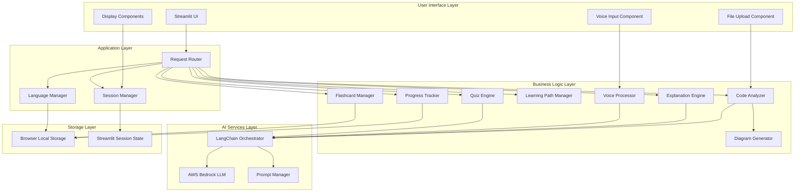
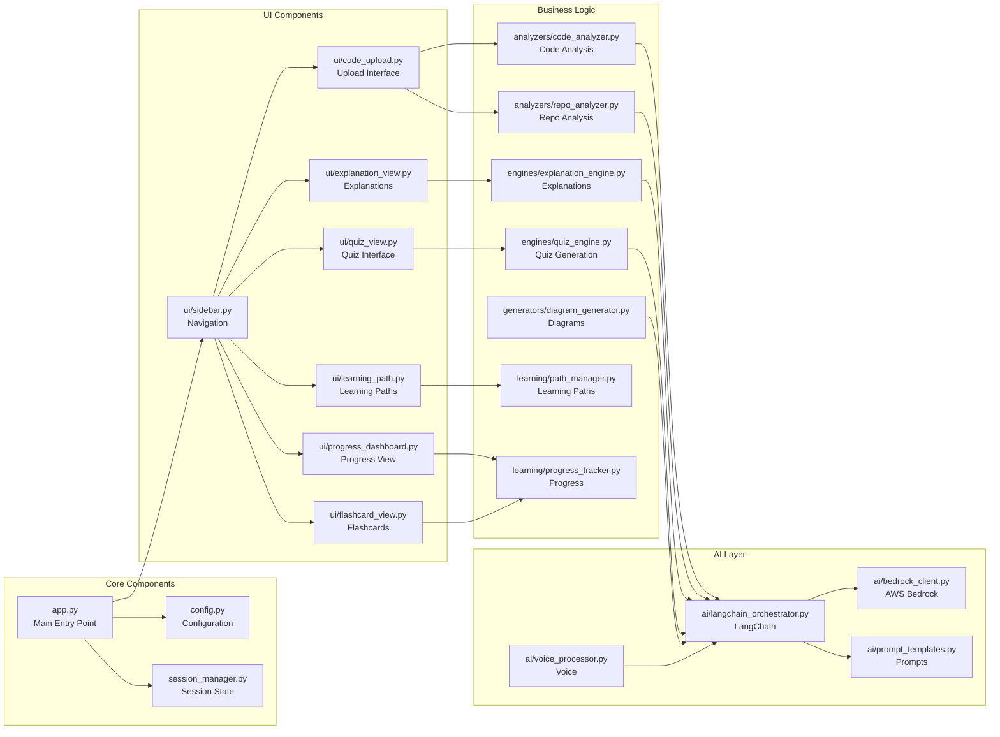
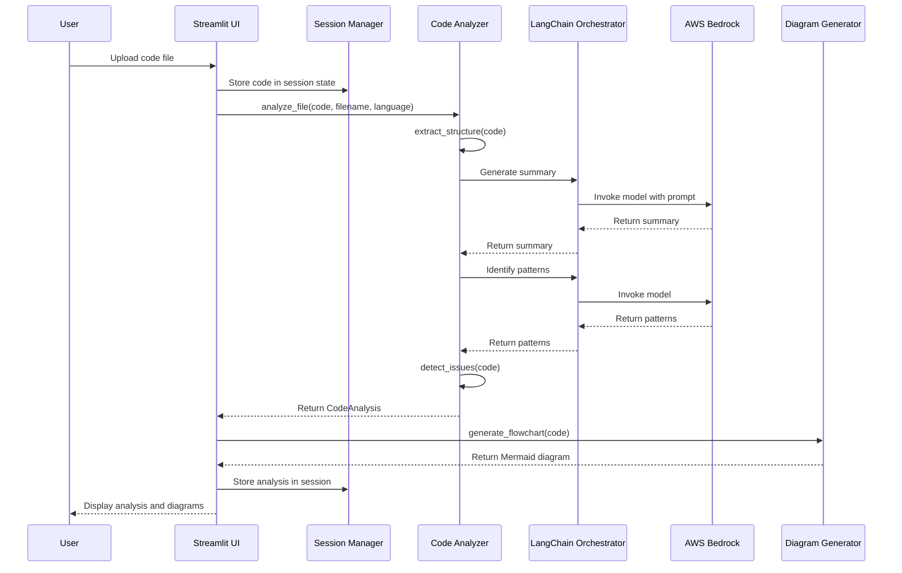
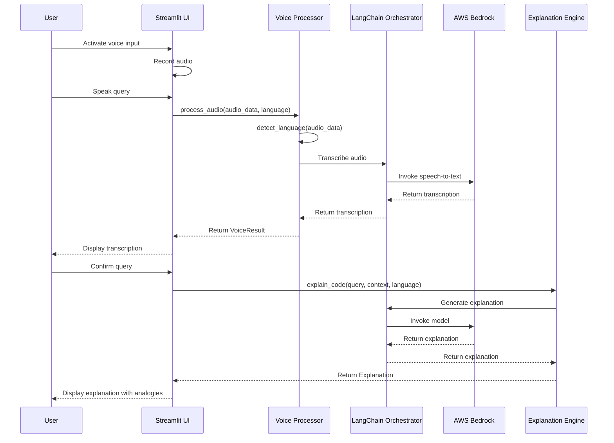
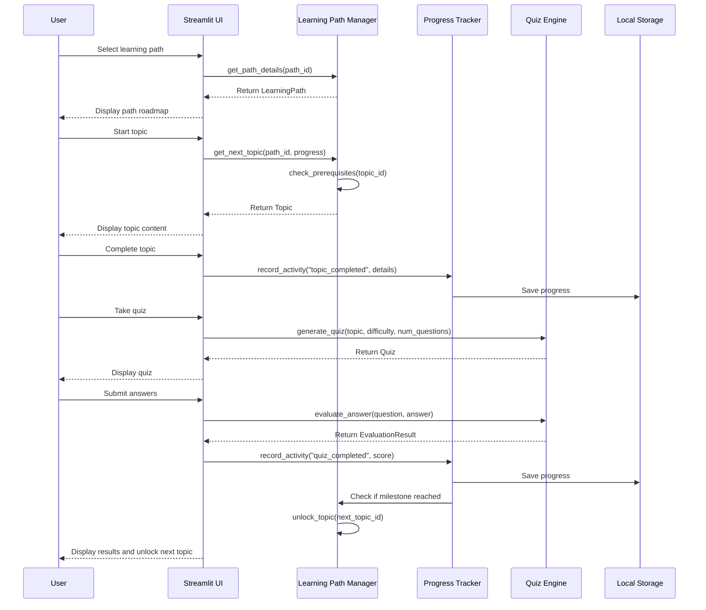
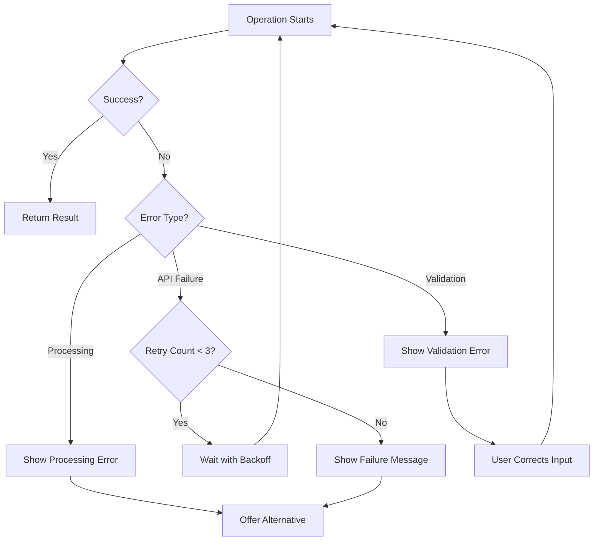

# Design Document: CodeGuru India

## Overview

CodeGuru India is a Streamlit-based AI learning platform that leverages AWS Bedrock LLMs and LangChain for intelligent code analysis and explanation. The system uses a modular architecture with clear separation between UI, business logic, and AI services. All data is processed in-memory without persistent storage, ensuring privacy and simplicity.

The application follows a component-based architecture where each major feature (code analysis, voice processing, learning paths, etc.) is implemented as an independent module that can be composed together. This design enables easy demonstration of specific features (like the e-commerce sample app) without requiring the full system.

## Architecture

### High-Level Architecture



### Component Architecture



## Components and Interfaces

### 1. Main Application (app.py)

**Purpose:** Entry point for the Streamlit application, handles routing and page layout.

**Interface:**
```python
def main() -> None:
    """Initialize and run the Streamlit application."""
    
def setup_page_config() -> None:
    """Configure Streamlit page settings."""
    
def initialize_session_state() -> None:
    """Initialize session state variables."""
    
def render_sidebar() -> str:
    """Render navigation sidebar and return selected page."""
    
def route_to_page(page: str) -> None:
    """Route to the selected page component."""
```

**Streamlit Components Used:**
- `st.set_page_config()` - Page configuration
- `st.sidebar` - Navigation menu
- `st.session_state` - State management

### 2. Configuration (config.py)

**Purpose:** Centralized configuration for AWS, LangChain, and application settings.

**Interface:**
```python
@dataclass
class AWSConfig:
    region: str
    bedrock_model_id: str
    max_tokens: int
    temperature: float

@dataclass
class AppConfig:
    supported_languages: List[str]
    max_file_size_mb: int
    max_repo_size_mb: int
    supported_extensions: List[str]
    session_timeout_days: int

def load_config() -> Tuple[AWSConfig, AppConfig]:
    """Load configuration from environment variables."""
```

### 3. Session Manager (session_manager.py)

**Purpose:** Manages user session state, preferences, and progress persistence.

**Interface:**
```python
class SessionManager:
    def __init__(self):
        """Initialize session manager with Streamlit session state."""
    
    def get_language_preference(self) -> str:
        """Get user's language preference."""
    
    def set_language_preference(self, language: str) -> None:
        """Set user's language preference."""
    
    def get_current_learning_path(self) -> Optional[str]:
        """Get active learning path."""
    
    def save_progress(self, activity_type: str, data: Dict) -> None:
        """Save learning progress to local storage."""
    
    def load_progress(self) -> Dict:
        """Load learning progress from local storage."""
    
    def get_uploaded_code(self) -> Optional[str]:
        """Get currently uploaded code from session."""
    
    def set_uploaded_code(self, code: str, filename: str) -> None:
        """Store uploaded code in session."""
```

### 4. Code Analyzer (analyzers/code_analyzer.py)

**Purpose:** Parses and analyzes uploaded code files, extracts structure and metadata.

**Interface:**
```python
class CodeAnalyzer:
    def __init__(self, langchain_orchestrator: LangChainOrchestrator):
        """Initialize with LangChain orchestrator."""
    
    def analyze_file(self, code: str, filename: str, language: str) -> CodeAnalysis:
        """Analyze a single code file."""
    
    def extract_structure(self, code: str, file_extension: str) -> CodeStructure:
        """Extract functions, classes, and imports from code."""
    
    def identify_patterns(self, code: str) -> List[Pattern]:
        """Identify design patterns and algorithms."""
    
    def detect_issues(self, code: str, language: str) -> List[Issue]:
        """Detect potential bugs and anti-patterns."""

@dataclass
class CodeAnalysis:
    summary: str
    structure: CodeStructure
    patterns: List[Pattern]
    issues: List[Issue]
    complexity_score: int

@dataclass
class CodeStructure:
    functions: List[Function]
    classes: List[Class]
    imports: List[str]
    main_logic: str

@dataclass
class Issue:
    severity: str  # "critical", "warning", "suggestion"
    line_number: int
    description: str
    suggestion: str
```

### 5. Repository Analyzer (analyzers/repo_analyzer.py)

**Purpose:** Clones and analyzes GitHub repositories.

**Interface:**
```python
class RepoAnalyzer:
    def __init__(self, code_analyzer: CodeAnalyzer):
        """Initialize with code analyzer."""
    
    def analyze_repo(self, repo_url: str, language: str) -> RepoAnalysis:
        """Clone and analyze a GitHub repository."""
    
    def clone_repo(self, repo_url: str) -> str:
        """Clone repository to temporary directory."""
    
    def get_file_tree(self, repo_path: str) -> Dict:
        """Generate file tree structure."""
    
    def analyze_files(self, repo_path: str, language: str) -> List[CodeAnalysis]:
        """Analyze all code files in repository."""

@dataclass
class RepoAnalysis:
    project_summary: str
    file_tree: Dict
    file_analyses: List[CodeAnalysis]
    tech_stack: List[str]
    architecture_type: str
```

### 6. Explanation Engine (engines/explanation_engine.py)

**Purpose:** Generates code explanations with analogies using LLM.

**Interface:**
```python
class ExplanationEngine:
    def __init__(self, langchain_orchestrator: LangChainOrchestrator):
        """Initialize with LangChain orchestrator."""
    
    def explain_code(self, code: str, context: str, language: str, 
                     difficulty: str = "intermediate") -> Explanation:
        """Generate explanation for code snippet."""
    
    def generate_analogy(self, concept: str, language: str) -> str:
        """Generate culturally relevant analogy for concept."""
    
    def simplify_explanation(self, explanation: str, language: str) -> str:
        """Simplify existing explanation to more basic level."""
    
    def explain_with_examples(self, code: str, language: str) -> Explanation:
        """Generate explanation with code examples."""

@dataclass
class Explanation:
    summary: str
    detailed_explanation: str
    analogies: List[str]
    examples: List[CodeExample]
    key_concepts: List[str]

@dataclass
class CodeExample:
    description: str
    code: str
    output: str
```

### 7. Diagram Generator (generators/diagram_generator.py)

**Purpose:** Creates visual diagrams from code using Mermaid syntax.

**Interface:**
```python
class DiagramGenerator:
    def generate_flowchart(self, function_code: str) -> str:
        """Generate Mermaid flowchart for function logic."""
    
    def generate_class_diagram(self, classes: List[Class]) -> str:
        """Generate Mermaid class diagram."""
    
    def generate_architecture_diagram(self, repo_analysis: RepoAnalysis) -> str:
        """Generate architecture diagram for project."""
    
    def generate_sequence_diagram(self, api_code: str) -> str:
        """Generate sequence diagram for API interactions."""
```

### 8. Voice Processor (ai/voice_processor.py)

**Purpose:** Handles voice input and transcription with accent support.

**Interface:**
```python
class VoiceProcessor:
    def __init__(self, langchain_orchestrator: LangChainOrchestrator):
        """Initialize with LangChain orchestrator."""
    
    def process_audio(self, audio_data: bytes, language: str) -> VoiceResult:
        """Process audio input and return transcription."""
    
    def detect_language(self, audio_data: bytes) -> str:
        """Detect language from audio."""
    
    def handle_accent(self, transcription: str, accent_type: str) -> str:
        """Improve transcription accuracy for regional accents."""

@dataclass
class VoiceResult:
    transcription: str
    confidence: float
    detected_language: str
```

### 9. Learning Path Manager (learning/path_manager.py)

**Purpose:** Manages structured learning paths and progression.

**Interface:**
```python
class LearningPathManager:
    def __init__(self):
        """Initialize with predefined learning paths."""
    
    def get_available_paths(self) -> List[LearningPath]:
        """Get all available learning paths."""
    
    def get_path_details(self, path_id: str) -> LearningPath:
        """Get detailed information about a learning path."""
    
    def get_next_topic(self, path_id: str, current_progress: Dict) -> Topic:
        """Get next recommended topic based on progress."""
    
    def check_prerequisites(self, topic_id: str, completed_topics: List[str]) -> bool:
        """Check if prerequisites are met for a topic."""
    
    def unlock_topic(self, path_id: str, topic_id: str) -> None:
        """Unlock a topic after prerequisites are met."""

@dataclass
class LearningPath:
    id: str
    name: str
    description: str
    topics: List[Topic]
    estimated_hours: int

@dataclass
class Topic:
    id: str
    name: str
    description: str
    prerequisites: List[str]
    resources: List[Resource]
    quiz_id: Optional[str]
```

### 10. Progress Tracker (learning/progress_tracker.py)

**Purpose:** Tracks and visualizes user learning progress.

**Interface:**
```python
class ProgressTracker:
    def __init__(self, session_manager: SessionManager):
        """Initialize with session manager."""
    
    def record_activity(self, activity_type: str, details: Dict) -> None:
        """Record a learning activity."""
    
    def get_statistics(self) -> ProgressStats:
        """Get overall learning statistics."""
    
    def get_skill_levels(self) -> Dict[str, int]:
        """Get skill level for each technology."""
    
    def calculate_streak(self) -> int:
        """Calculate current learning streak in days."""
    
    def get_weekly_summary(self) -> WeeklySummary:
        """Get summary of past week's activities."""

@dataclass
class ProgressStats:
    topics_completed: int
    quizzes_taken: int
    average_quiz_score: float
    total_time_minutes: int
    current_streak: int
    skill_levels: Dict[str, int]

@dataclass
class WeeklySummary:
    activities_completed: int
    time_spent_minutes: int
    topics_learned: List[str]
    quiz_scores: List[float]
```

### 11. Quiz Engine (engines/quiz_engine.py)

**Purpose:** Generates and evaluates quizzes based on code and topics.

**Interface:**
```python
class QuizEngine:
    def __init__(self, langchain_orchestrator: LangChainOrchestrator):
        """Initialize with LangChain orchestrator."""
    
    def generate_quiz(self, topic: str, difficulty: str, 
                     num_questions: int, language: str) -> Quiz:
        """Generate a quiz for a topic."""
    
    def evaluate_answer(self, question: Question, user_answer: str) -> EvaluationResult:
        """Evaluate user's answer to a question."""
    
    def generate_explanation(self, question: Question, user_answer: str, 
                           language: str) -> str:
        """Generate explanation for correct/incorrect answer."""

@dataclass
class Quiz:
    id: str
    topic: str
    questions: List[Question]
    time_limit_minutes: int

@dataclass
class Question:
    id: str
    type: str  # "multiple_choice", "code_completion", "debugging"
    question_text: str
    options: Optional[List[str]]
    correct_answer: str
    explanation: str

@dataclass
class EvaluationResult:
    is_correct: bool
    score: float
    feedback: str
    explanation: str
```

### 12. Flashcard Manager (learning/flashcard_manager.py)

**Purpose:** Manages flashcard creation, review, and spaced repetition.

**Interface:**
```python
class FlashcardManager:
    def __init__(self, session_manager: SessionManager):
        """Initialize with session manager."""
    
    def generate_flashcards(self, code_analysis: CodeAnalysis, 
                           language: str) -> List[Flashcard]:
        """Generate flashcards from code analysis."""
    
    def create_custom_flashcard(self, front: str, back: str, topic: str) -> Flashcard:
        """Create a custom flashcard."""
    
    def get_flashcards_for_review(self, topic: Optional[str] = None) -> List[Flashcard]:
        """Get flashcards due for review."""
    
    def mark_reviewed(self, flashcard_id: str, difficulty: str) -> None:
        """Mark flashcard as reviewed and update review schedule."""
    
    def mark_mastered(self, flashcard_id: str) -> None:
        """Mark flashcard as mastered."""

@dataclass
class Flashcard:
    id: str
    front: str
    back: str
    topic: str
    difficulty: str
    last_reviewed: Optional[datetime]
    next_review: datetime
    mastered: bool
```

### 13. LangChain Orchestrator (ai/langchain_orchestrator.py)

**Purpose:** Orchestrates LLM calls using LangChain and AWS Bedrock.

**Interface:**
```python
class LangChainOrchestrator:
    def __init__(self, bedrock_client: BedrockClient, prompt_manager: PromptManager):
        """Initialize with Bedrock client and prompt manager."""
    
    def generate_completion(self, prompt: str, max_tokens: int = 1000) -> str:
        """Generate completion from LLM."""
    
    def generate_with_chain(self, chain_type: str, inputs: Dict) -> str:
        """Execute a LangChain chain with inputs."""
    
    def generate_structured_output(self, prompt: str, 
                                   output_schema: Dict) -> Dict:
        """Generate structured output matching schema."""
```

### 14. Bedrock Client (ai/bedrock_client.py)

**Purpose:** Handles AWS Bedrock API interactions.

**Interface:**
```python
class BedrockClient:
    def __init__(self, config: AWSConfig):
        """Initialize AWS Bedrock client."""
    
    def invoke_model(self, prompt: str, model_id: str, 
                    parameters: Dict) -> str:
        """Invoke Bedrock model and return response."""
    
    def invoke_model_with_streaming(self, prompt: str, model_id: str, 
                                   parameters: Dict) -> Iterator[str]:
        """Invoke model with streaming response."""
```

### 15. Prompt Manager (ai/prompt_templates.py)

**Purpose:** Manages prompt templates for different tasks and languages.

**Interface:**
```python
class PromptManager:
    def get_code_explanation_prompt(self, code: str, language: str, 
                                   difficulty: str) -> str:
        """Get prompt for code explanation."""
    
    def get_analogy_generation_prompt(self, concept: str, language: str) -> str:
        """Get prompt for analogy generation."""
    
    def get_quiz_generation_prompt(self, topic: str, difficulty: str, 
                                  num_questions: int, language: str) -> str:
        """Get prompt for quiz generation."""
    
    def get_debugging_prompt(self, code: str, language: str) -> str:
        """Get prompt for debugging assistance."""
    
    def get_summary_prompt(self, code: str, language: str) -> str:
        """Get prompt for code summarization."""
```

## Data Models

### Session State Schema

```python
# Stored in st.session_state
{
    "user_id": str,  # Generated UUID for session
    "language_preference": str,  # "english", "hindi", "telugu"
    "current_page": str,
    "uploaded_code": Optional[str],
    "uploaded_filename": Optional[str],
    "current_analysis": Optional[CodeAnalysis],
    "current_learning_path": Optional[str],
    "quiz_in_progress": Optional[Quiz],
    "flashcards_for_review": List[Flashcard],
}
```

### Local Storage Schema

```python
# Stored in browser localStorage via Streamlit components
{
    "user_preferences": {
        "language": str,
        "theme": str,
        "difficulty_level": str
    },
    "progress": {
        "completed_topics": List[str],
        "quiz_scores": List[Dict],
        "learning_paths": Dict[str, Dict],
        "skill_levels": Dict[str, int],
        "streak_data": {
            "current_streak": int,
            "last_activity_date": str,
            "longest_streak": int
        }
    },
    "flashcards": {
        "custom_flashcards": List[Flashcard],
        "review_schedule": Dict[str, datetime]
    },
    "activity_log": List[{
        "timestamp": str,
        "activity_type": str,
        "details": Dict
    }]
}
```

## Data Flow

### Code Upload and Analysis Flow



### Voice Query Flow



### Learning Path Progression Flow



## Correctness Properties

*A property is a characteristic or behavior that should hold true across all valid executions of a system—essentially, a formal statement about what the system should do. Properties serve as the bridge between human-readable specifications and machine-verifiable correctness guarantees.*


### Language and Localization Properties

**Property 1: Language Preference Persistence**
*For any* language selection (English, Hindi, Telugu), if a user sets their preference and the session is reloaded, the system should restore the same language preference.
**Validates: Requirements 1.2**

**Property 2: Consistent Language Rendering**
*For any* system output (explanations, summaries, UI text) and any selected language, all text should be rendered in the user's selected language.
**Validates: Requirements 1.3, 4.6**

**Property 3: Language Switch Performance**
*For any* language switch operation, all UI elements should update within 500ms.
**Validates: Requirements 1.5**

### Voice Processing Properties

**Property 4: Voice Transcription Completeness**
*For any* valid audio input, the Voice Processor should return a transcription with text, confidence score, and detected language.
**Validates: Requirements 2.1, 2.5**

**Property 5: Voice Processing Performance**
*For any* voice query, processing should complete within 3 seconds of audio completion.
**Validates: Requirements 2.6**

**Property 6: Voice Error Handling**
*For any* invalid or unclear audio input, the system should return an error message prompting the user to retry.
**Validates: Requirements 2.4**

### Code Analysis Properties

**Property 7: File Format Support**
*For any* file with extension in [.py, .js, .jsx, .ts, .tsx, .java, .cpp, .c, .go, .rb], the system should accept and parse the file.
**Validates: Requirements 3.1**

**Property 8: Code Parsing Performance**
*For any* valid code file, parsing and validation should complete within 2 seconds.
**Validates: Requirements 3.2**

**Property 9: Repository Analysis Completeness**
*For any* valid GitHub repository URL, the system should successfully clone and return a repository analysis with file tree and tech stack.
**Validates: Requirements 3.3, 3.4**

**Property 10: File Processing Error Handling**
*For any* invalid file or repository input, the system should return a descriptive error message without crashing.
**Validates: Requirements 3.5**

### Code Summarization Properties

**Property 11: Summary Generation Performance**
*For any* uploaded code, summary generation should complete within 5 seconds.
**Validates: Requirements 4.1**

**Property 12: Structure Extraction Completeness**
*For any* code containing functions or classes, the analysis should identify and list all main functions, classes, and modules.
**Validates: Requirements 4.2**

**Property 13: Pattern Identification**
*For any* code containing known design patterns or algorithms, the system should identify and highlight them in the analysis.
**Validates: Requirements 4.4**

### Debugging Properties

**Property 14: Issue Detection Completeness**
*For any* code analysis request, the system should return a list of issues (possibly empty) with each issue containing severity, line number, description, and suggestion.
**Validates: Requirements 5.1, 5.2, 5.3, 5.4**

**Property 15: Issue Prioritization**
*For any* list of detected issues, they should be ordered by severity (critical, then warning, then suggestion).
**Validates: Requirements 5.5**

### Explanation Properties

**Property 16: Analogy Inclusion**
*For any* code explanation, the output should include at least one real-world analogy.
**Validates: Requirements 6.1**

**Property 17: Example Completeness**
*For any* explanation containing analogies, there should also be code examples provided.
**Validates: Requirements 6.4**

**Property 18: Explanation Simplification**
*For any* explanation, if simplification is requested, the system should generate a different (simpler) explanation.
**Validates: Requirements 6.5**

### Flashcard Properties

**Property 19: Flashcard Generation**
*For any* code analysis, the system should generate at least one flashcard based on the concepts identified.
**Validates: Requirements 7.1**

**Property 20: Flashcard Organization**
*For any* set of flashcards, they should be organized by topic and difficulty level.
**Validates: Requirements 7.4**

**Property 21: Flashcard Review Tracking**
*For any* reviewed flashcard, it should appear in the review history with timestamp.
**Validates: Requirements 7.5**

**Property 22: Mastered Flashcard Scheduling**
*For any* flashcard marked as mastered, the next review date should be at least 7 days in the future (reduced frequency).
**Validates: Requirements 7.7**

### Quiz Properties

**Property 23: Quiz Generation**
*For any* topic and difficulty level, the system should generate a quiz with the requested number of questions.
**Validates: Requirements 8.1**

**Property 24: Quiz Feedback Completeness**
*For any* submitted quiz answer, the system should provide immediate feedback including correctness, explanation, and score.
**Validates: Requirements 8.3, 8.4**

**Property 25: Quiz Score Persistence**
*For any* completed quiz, the score and timestamp should be recorded in progress tracking.
**Validates: Requirements 8.5**

**Property 26: Quiz Summary Completeness**
*For any* completed quiz, the summary should include total score, time taken, and number of correct answers.
**Validates: Requirements 8.7**

### Learning Path Properties

**Property 27: Learning Path Roadmap**
*For any* selected learning path, the system should return a roadmap with milestones and topics.
**Validates: Requirements 9.2**

**Property 28: Progress Tracking**
*For any* completed learning activity, the progress should be updated and persisted.
**Validates: Requirements 9.3**

**Property 29: Prerequisite Enforcement**
*For any* topic with prerequisites, it should only be accessible if all prerequisite topics are marked as completed.
**Validates: Requirements 9.4**

**Property 30: Milestone Achievement**
*For any* completed milestone, the system should generate a certificate or badge.
**Validates: Requirements 9.5**

**Property 31: Topic Recommendation**
*For any* learning state, the system should recommend a next topic based on progress and performance.
**Validates: Requirements 9.6**

### Diagram Generation Properties

**Property 32: Diagram Generation Completeness**
*For any* code input, the system should generate appropriate diagrams (flowchart for functions, class diagram for OOP code, architecture diagram for projects, sequence diagram for APIs).
**Validates: Requirements 10.1, 10.2, 10.3, 10.4**

**Property 33: Mermaid Format Compliance**
*For any* generated diagram, the output should be valid Mermaid syntax that can be rendered.
**Validates: Requirements 10.5**

**Property 34: Diagram Interactivity**
*For any* diagram element click, the system should highlight the corresponding code section.
**Validates: Requirements 10.6**

### Progress Tracking Properties

**Property 35: Metrics Tracking**
*For any* learning activity (topic completion, quiz, flashcard review), the corresponding metrics (topics completed, quiz scores, time spent, streak days) should be updated.
**Validates: Requirements 11.2**

**Property 36: Skill Level Tracking**
*For any* technology in the system, there should be a skill level (0-100) that increases with completed activities.
**Validates: Requirements 11.4**

**Property 37: Performance Comparison**
*For any* time period, the system should be able to compare current performance metrics with past performance metrics.
**Validates: Requirements 11.6**

**Property 38: Weekly Summary Generation**
*For any* week with learning activities, the system should generate a summary with activities completed, time spent, and topics learned.
**Validates: Requirements 11.7**

### Tech Stack Support Properties

**Property 39: Framework-Specific Insights**
*For any* code using React, Node.js, Express, MongoDB, AWS Lambda, AWS S3, or AWS DynamoDB, the explanation should include framework-specific insights and best practices.
**Validates: Requirements 12.1, 12.5**

### Session Management Properties

**Property 40: Preference Persistence**
*For any* user preference change, it should be saved to local storage and retrievable in future sessions.
**Validates: Requirements 13.1**

**Property 41: Progress Persistence**
*For any* completed activity, the progress should be saved immediately and persist across sessions.
**Validates: Requirements 13.2**

**Property 42: Session State Round-Trip**
*For any* session state, if the application is closed and reopened, the previous state should be restored (language, current path, progress).
**Validates: Requirements 13.3**

**Property 43: Session Data Retention**
*For any* saved session data, it should remain accessible for at least 30 days.
**Validates: Requirements 13.4**

**Property 44: Graceful Error Recovery**
*For any* corrupted or unavailable session data, the system should start a fresh session without errors or crashes.
**Validates: Requirements 13.5**

## Error Handling

### Error Categories

1. **Input Validation Errors**
   - Invalid file formats or sizes
   - Malformed repository URLs
   - Corrupted audio input
   - Invalid session data

2. **External Service Errors**
   - AWS Bedrock API failures
   - GitHub API rate limiting
   - Network timeouts

3. **Processing Errors**
   - Code parsing failures
   - LLM generation errors
   - Diagram rendering failures

### Error Handling Strategy

**Graceful Degradation:**
- When AWS Bedrock is unavailable, display cached explanations or fallback messages
- When GitHub API fails, allow manual file upload as alternative
- When diagram generation fails, show code structure in text format

**User-Friendly Messages:**
- All errors should display clear, actionable messages in the user's selected language
- Include suggestions for resolution (e.g., "Try uploading a smaller file" for size errors)
- Provide contact/support information for persistent errors

**Error Logging:**
- Log all errors with timestamp, error type, and context
- Use Streamlit's logging capabilities for debugging
- Include stack traces for development environments only

**Retry Logic:**
- Implement exponential backoff for AWS Bedrock API calls
- Allow users to manually retry failed operations
- Cache successful LLM responses to reduce API calls

### Error Recovery Flows



## Testing Strategy

### Dual Testing Approach

CodeGuru India will use both unit testing and property-based testing to ensure comprehensive coverage and correctness.

**Unit Tests:**
- Focus on specific examples and edge cases
- Test integration points between components
- Verify error conditions and boundary cases
- Test UI component rendering and interactions
- Validate specific file formats and inputs

**Property-Based Tests:**
- Verify universal properties across all inputs
- Test with randomized data (code snippets, languages, user inputs)
- Ensure correctness properties hold for all valid inputs
- Run minimum 100 iterations per property test
- Each test references its design document property

### Testing Framework Selection

**Unit Testing:**
- Framework: pytest
- UI Testing: Streamlit testing utilities
- Mocking: unittest.mock for AWS Bedrock calls

**Property-Based Testing:**
- Framework: Hypothesis (Python)
- Generators for: code snippets, file paths, user preferences, learning activities
- Custom strategies for domain-specific data (flashcards, quizzes, learning paths)

### Test Organization

```
tests/
├── unit/
│   ├── test_code_analyzer.py
│   ├── test_explanation_engine.py
│   ├── test_voice_processor.py
│   ├── test_learning_path_manager.py
│   ├── test_progress_tracker.py
│   ├── test_quiz_engine.py
│   ├── test_flashcard_manager.py
│   └── test_diagram_generator.py
├── property/
│   ├── test_language_properties.py
│   ├── test_voice_properties.py
│   ├── test_analysis_properties.py
│   ├── test_learning_properties.py
│   ├── test_session_properties.py
│   └── test_performance_properties.py
├── integration/
│   ├── test_code_upload_flow.py
│   ├── test_learning_path_flow.py
│   └── test_quiz_flow.py
└── conftest.py  # Shared fixtures and configurations
```

### Property Test Configuration

Each property test must:
1. Run minimum 100 iterations (configured via Hypothesis settings)
2. Include a comment tag referencing the design property
3. Use appropriate generators for input data
4. Assert the property holds for all generated inputs

**Example Property Test Structure:**
```python
from hypothesis import given, settings
import hypothesis.strategies as st

# Feature: code-guru-india, Property 1: Language Preference Persistence
@settings(max_examples=100)
@given(language=st.sampled_from(['english', 'hindi', 'telugu']))
def test_language_preference_persistence(language):
    """For any language selection, setting and reloading should restore the same preference."""
    session_manager = SessionManager()
    session_manager.set_language_preference(language)
    
    # Simulate session reload
    session_manager.reload_from_storage()
    
    assert session_manager.get_language_preference() == language
```

### Test Coverage Goals

- **Unit Test Coverage:** Minimum 80% code coverage
- **Property Test Coverage:** All 44 correctness properties implemented
- **Integration Test Coverage:** All major user flows (upload, analyze, learn, quiz)
- **Edge Case Coverage:** File size limits, empty inputs, corrupted data

### Continuous Testing

- Run unit tests on every code change
- Run property tests before merging to main branch
- Run integration tests nightly
- Monitor test execution time and optimize slow tests

### Mock Strategy

**AWS Bedrock Mocking:**
- Mock all Bedrock API calls in unit tests
- Use recorded responses for consistent test behavior
- Test both success and failure scenarios
- Validate prompt structure and parameters

**GitHub API Mocking:**
- Mock repository cloning in tests
- Use sample repositories for integration tests
- Test rate limiting and error scenarios

**Local Storage Mocking:**
- Mock browser localStorage in tests
- Test data persistence and retrieval
- Validate data format and schema

## UI Component Specifications (Streamlit)

### 1. Main Navigation (Sidebar)

**Streamlit Components:**
```python
st.sidebar.title("CodeGuru India 🇮🇳")
st.sidebar.selectbox("Language", ["English", "हिंदी", "తెలుగు"])
st.sidebar.radio("Navigate", [
    "🏠 Home",
    "📤 Upload Code",
    "📚 Learning Paths",
    "🎯 Quizzes",
    "🗂️ Flashcards",
    "📊 Progress"
])
```

**Features:**
- Language selector at top
- Icon-based navigation menu
- Active page highlighting
- User progress indicator

### 2. Code Upload Interface

**Streamlit Components:**
```python
st.title("Upload Code for Analysis")

# File upload
uploaded_file = st.file_uploader(
    "Choose a code file",
    type=['py', 'js', 'jsx', 'ts', 'tsx', 'java', 'cpp', 'c', 'go', 'rb']
)

# Repository URL input
repo_url = st.text_input("Or enter GitHub repository URL")

# Voice input button
if st.button("🎤 Ask via Voice"):
    audio = st.audio_input("Record your question")

# Analysis options
col1, col2 = st.columns(2)
with col1:
    include_debugging = st.checkbox("Include debugging suggestions", value=True)
with col2:
    difficulty_level = st.select_slider(
        "Explanation difficulty",
        options=["Beginner", "Intermediate", "Advanced"]
    )

# Analyze button
if st.button("Analyze Code", type="primary"):
    with st.spinner("Analyzing code..."):
        # Analysis logic
        pass
```

### 3. Code Explanation View

**Streamlit Components:**
```python
st.title("Code Analysis Results")

# Tabs for different views
tab1, tab2, tab3, tab4 = st.tabs(["📝 Summary", "🔍 Details", "📊 Diagrams", "🐛 Issues"])

with tab1:
    st.subheader("Code Summary")
    st.write(analysis.summary)
    
    st.subheader("Key Concepts")
    for concept in analysis.key_concepts:
        st.info(concept)
    
    st.subheader("Analogies")
    for analogy in analysis.analogies:
        st.success(f"💡 {analogy}")

with tab2:
    st.subheader("Detailed Explanation")
    st.markdown(analysis.detailed_explanation)
    
    st.subheader("Code Examples")
    for example in analysis.examples:
        st.code(example.code, language="python")
        st.caption(example.description)

with tab3:
    st.subheader("Visual Diagrams")
    diagram_type = st.selectbox("Select diagram", ["Flowchart", "Class Diagram", "Architecture"])
    st.mermaid(diagram_generator.generate(diagram_type))
    
    col1, col2 = st.columns(2)
    with col1:
        st.download_button("Download PNG", data=diagram_png)
    with col2:
        st.download_button("Download SVG", data=diagram_svg)

with tab4:
    st.subheader("Code Issues")
    for issue in analysis.issues:
        if issue.severity == "critical":
            st.error(f"🔴 Line {issue.line_number}: {issue.description}")
        elif issue.severity == "warning":
            st.warning(f"🟡 Line {issue.line_number}: {issue.description}")
        else:
            st.info(f"🔵 Line {issue.line_number}: {issue.description}")
        
        with st.expander("See suggestion"):
            st.write(issue.suggestion)
```

### 4. Learning Path View

**Streamlit Components:**
```python
st.title("Learning Paths")

# Path selection
selected_path = st.selectbox(
    "Choose your learning path",
    ["DSA Fundamentals", "Backend Development", "Frontend Development", 
     "Full-Stack Development", "AWS Services"]
)

# Progress bar
progress = calculate_progress(selected_path)
st.progress(progress / 100)
st.caption(f"{progress}% Complete")

# Roadmap visualization
st.subheader("Learning Roadmap")
for topic in learning_path.topics:
    with st.container():
        col1, col2, col3 = st.columns([1, 4, 1])
        
        with col1:
            if topic.completed:
                st.success("✅")
            elif topic.locked:
                st.warning("🔒")
            else:
                st.info("📖")
        
        with col2:
            st.write(f"**{topic.name}**")
            st.caption(topic.description)
        
        with col3:
            if not topic.locked:
                if st.button("Start", key=topic.id):
                    navigate_to_topic(topic.id)
```

### 5. Quiz Interface

**Streamlit Components:**
```python
st.title("Quiz: {topic_name}")

# Quiz progress
st.progress(current_question / total_questions)
st.caption(f"Question {current_question} of {total_questions}")

# Question display
st.subheader(f"Question {current_question}")
st.write(question.question_text)

# Answer input based on question type
if question.type == "multiple_choice":
    user_answer = st.radio("Select your answer:", question.options, key=f"q_{question.id}")
elif question.type == "code_completion":
    user_answer = st.text_area("Complete the code:", key=f"q_{question.id}")
elif question.type == "debugging":
    st.code(question.buggy_code, language="python")
    user_answer = st.text_area("Explain the bug and fix:", key=f"q_{question.id}")

# Navigation buttons
col1, col2, col3 = st.columns([1, 1, 1])
with col1:
    if st.button("⬅️ Previous"):
        go_to_previous_question()
with col2:
    if st.button("Submit Answer", type="primary"):
        evaluate_answer(user_answer)
with col3:
    if st.button("Next ➡️"):
        go_to_next_question()

# Timer
st.sidebar.metric("Time Remaining", format_time(time_remaining))
```

### 6. Flashcard View

**Streamlit Components:**
```python
st.title("Flashcards")

# Filter options
col1, col2 = st.columns(2)
with col1:
    topic_filter = st.selectbox("Topic", ["All"] + list(topics))
with col2:
    difficulty_filter = st.selectbox("Difficulty", ["All", "Easy", "Medium", "Hard"])

# Flashcard display
if flashcards:
    flashcard = flashcards[current_index]
    
    # Card container
    with st.container():
        st.markdown(f"### Card {current_index + 1} of {len(flashcards)}")
        
        # Flip animation using session state
        if st.session_state.get('card_flipped', False):
            st.info(flashcard.back)
            if st.button("🔄 Flip to Front"):
                st.session_state.card_flipped = False
                st.rerun()
        else:
            st.success(flashcard.front)
            if st.button("🔄 Flip to Back"):
                st.session_state.card_flipped = True
                st.rerun()
    
    # Navigation and rating
    col1, col2, col3 = st.columns([1, 2, 1])
    with col1:
        if st.button("⬅️ Previous"):
            navigate_flashcard(-1)
    with col2:
        difficulty = st.select_slider(
            "How difficult was this?",
            options=["Easy", "Medium", "Hard"]
        )
        if st.button("Mark Reviewed"):
            mark_reviewed(flashcard.id, difficulty)
    with col3:
        if st.button("Next ➡️"):
            navigate_flashcard(1)
    
    # Master button
    if st.button("✅ Mark as Mastered"):
        mark_mastered(flashcard.id)
else:
    st.info("No flashcards available. Generate some from your code analysis!")
```

### 7. Progress Dashboard

**Streamlit Components:**
```python
st.title("Your Learning Progress")

# Key metrics
col1, col2, col3, col4 = st.columns(4)
with col1:
    st.metric("Topics Completed", stats.topics_completed, delta="+3 this week")
with col2:
    st.metric("Avg Quiz Score", f"{stats.average_quiz_score}%", delta="+5%")
with col3:
    st.metric("Learning Streak", f"{stats.current_streak} days", delta="+1")
with col4:
    st.metric("Time Spent", f"{stats.total_time_minutes // 60}h", delta="+2h")

# Charts
st.subheader("Progress Over Time")
st.line_chart(progress_data)

st.subheader("Skill Levels")
for tech, level in stats.skill_levels.items():
    st.write(f"**{tech}**")
    st.progress(level / 100)
    st.caption(f"Level {level}/100")

# Weekly summary
st.subheader("This Week's Summary")
summary = get_weekly_summary()
st.write(f"✅ Completed {summary.activities_completed} activities")
st.write(f"⏱️ Spent {summary.time_spent_minutes} minutes learning")
st.write(f"📚 Learned: {', '.join(summary.topics_learned)}")

# Achievement badges
st.subheader("Achievements")
cols = st.columns(5)
for idx, badge in enumerate(achievements):
    with cols[idx % 5]:
        st.image(badge.icon)
        st.caption(badge.name)
```

## Deployment and Configuration

### Environment Variables

```bash
# AWS Configuration
AWS_REGION=us-east-1
AWS_BEDROCK_MODEL_ID=anthropic.claude-3-sonnet-20240229-v1:0
AWS_ACCESS_KEY_ID=<your-key>
AWS_SECRET_ACCESS_KEY=<your-secret>

# Application Configuration
MAX_FILE_SIZE_MB=10
MAX_REPO_SIZE_MB=100
SESSION_TIMEOUT_DAYS=30
DEFAULT_LANGUAGE=english

# LangChain Configuration
LANGCHAIN_TRACING_V2=true
LANGCHAIN_API_KEY=<your-key>
```

### Streamlit Configuration

```toml
# .streamlit/config.toml
[theme]
primaryColor = "#FF6B35"
backgroundColor = "#FFFFFF"
secondaryBackgroundColor = "#F0F2F6"
textColor = "#262730"
font = "sans serif"

[server]
maxUploadSize = 10
enableXsrfProtection = true
enableCORS = false

[browser]
gatherUsageStats = false
```

### Deployment Options

**Option 1: Streamlit Cloud**
- Push code to GitHub repository
- Connect to Streamlit Cloud
- Configure secrets for AWS credentials
- Deploy with one click

**Option 2: AWS EC2**
- Launch EC2 instance with Python 3.9+
- Install dependencies
- Configure security groups for port 8501
- Run with: `streamlit run app.py`

**Option 3: Docker Container**
```dockerfile
FROM python:3.9-slim
WORKDIR /app
COPY requirements.txt .
RUN pip install -r requirements.txt
COPY . .
EXPOSE 8501
CMD ["streamlit", "run", "app.py"]
```

## Security Considerations

1. **Code Privacy:** All uploaded code is processed in-memory and never stored permanently
2. **API Key Security:** AWS credentials stored in environment variables, never in code
3. **Input Sanitization:** All user inputs sanitized to prevent injection attacks
4. **HTTPS Only:** Enforce HTTPS for all communications in production
5. **Rate Limiting:** Implement rate limiting for API calls to prevent abuse
6. **Session Security:** Use secure session tokens and CSRF protection
