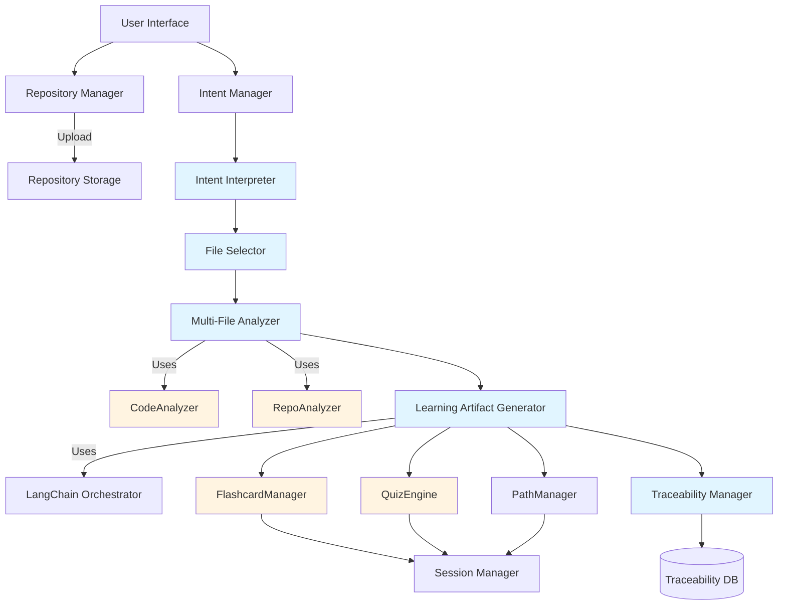
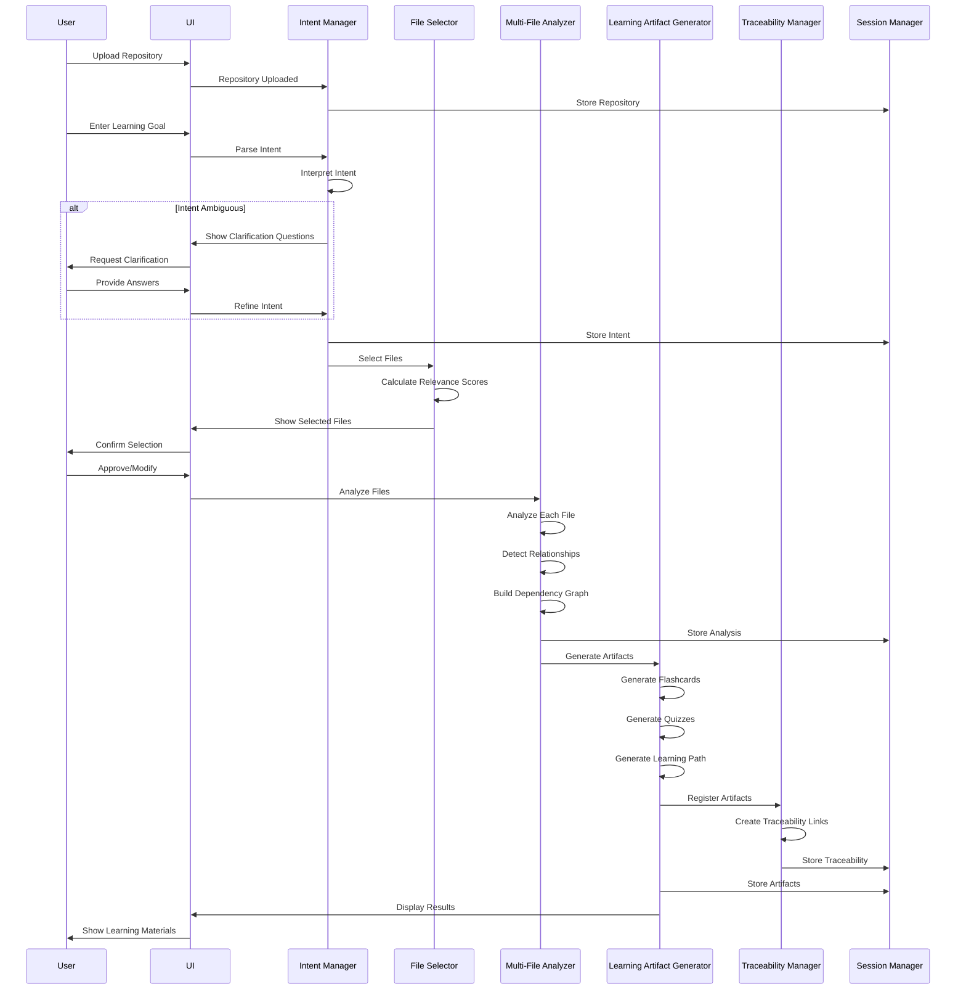
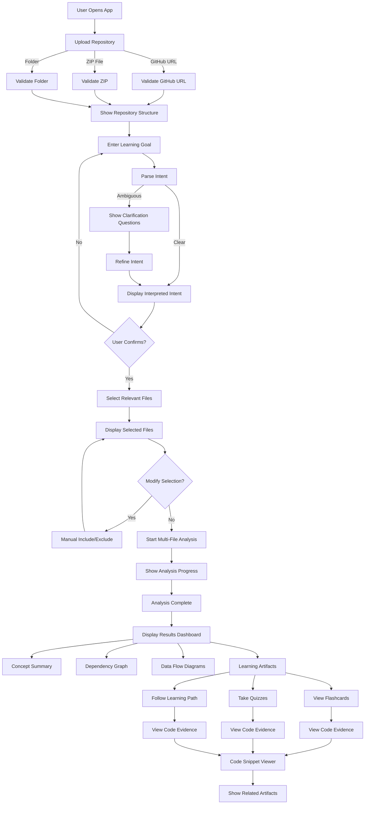

# Design Document: Intent-Driven Repository Analysis System

## Overview

The Intent-Driven Repository Analysis System extends CodeGuru India from a single-file code analyzer into an intelligent, multi-file repository analysis platform. The system interprets natural language learning goals, intelligently selects relevant code files, performs comprehensive multi-file analysis, and generates personalized learning materials (flashcards, quizzes, learning paths) that are directly traceable to specific code snippets.

### Key Capabilities

- Natural language intent interpretation with clarification dialogs
- Intelligent file selection based on relevance scoring
- Multi-file analysis with dependency tracking and relationship mapping
- Code-grounded learning artifact generation (flashcards, quizzes, learning paths)
- Complete traceability between learning materials and source code
- Multi-language support (English, Hindi, Telugu)
- Session persistence and progress tracking

### Design Principles

1. **Code-First Learning**: All learning artifacts must reference actual code from the repository
2. **Traceability**: Every flashcard, quiz question, and learning path step must be traceable to specific files and line numbers
3. **Intent-Driven**: User goals drive file selection and analysis scope
4. **Modularity**: Components are loosely coupled and can be enhanced independently
5. **Extensibility**: New intent types, analysis strategies, and artifact generators can be added easily

## Architecture

### System Architecture Diagram



Legend:
- Blue: New components
- Yellow: Existing components being integrated
- White: Supporting infrastructure

### Component Layers

1. **Presentation Layer**: Streamlit UI components for user interaction
2. **Intent Layer**: Intent interpretation and clarification
3. **Selection Layer**: File relevance scoring and selection
4. **Analysis Layer**: Multi-file code analysis and relationship detection
5. **Generation Layer**: Learning artifact creation with traceability
6. **Persistence Layer**: Session management and traceability storage

### Integration Points

The system integrates with existing CodeGuru India components:

- **CodeAnalyzer**: Used by Multi_File_Analyzer for individual file analysis
- **RepoAnalyzer**: Used for repository structure and metadata extraction
- **LangChainOrchestrator**: Used for AI-powered content generation
- **FlashcardManager**: Extended to support code evidence references
- **QuizEngine**: Extended to support code-based questions with traceability
- **SessionManager**: Used for progress tracking and state persistence


## Components and Interfaces

### 1. Intent Interpreter

**Purpose**: Parses natural language user input to extract structured learning goals.

**Location**: `analyzers/intent_interpreter.py`

**Key Responsibilities**:
- Parse natural language intent statements
- Extract primary and secondary intents
- Determine analysis scope (folders, technologies, entire repo)
- Identify target audience level (beginner, intermediate, advanced)
- Detect ambiguity and generate clarification questions

**Interface**:

```python
@dataclass
class UserIntent:
    """Structured representation of user's learning goal."""
    primary_intent: str  # Main learning goal
    secondary_intents: List[str]  # Additional goals
    scope: IntentScope  # Analysis scope
    audience_level: str  # beginner, intermediate, advanced
    technologies: List[str]  # Specific technologies mentioned
    confidence_score: float  # 0.0-1.0, how confident the interpretation is

@dataclass
class IntentScope:
    """Defines the scope of analysis."""
    scope_type: str  # "entire_repo", "specific_folders", "specific_files", "technology"
    target_paths: List[str]  # Specific paths if applicable
    exclude_paths: List[str]  # Paths to exclude

class IntentInterpreter:
    def __init__(self, langchain_orchestrator: LangChainOrchestrator):
        """Initialize with AI orchestrator for NLP."""
        
    def interpret_intent(self, user_input: str, repo_context: RepoAnalysis) -> UserIntent:
        """Parse user input and extract structured intent."""
        
    def generate_clarification_questions(self, intent: UserIntent) -> List[str]:
        """Generate questions when intent is ambiguous."""
        
    def refine_intent(self, intent: UserIntent, user_responses: Dict[str, str]) -> UserIntent:
        """Refine intent based on user's clarification responses."""
        
    def suggest_intents(self, repo_context: RepoAnalysis) -> List[str]:
        """Suggest possible intents based on repository content."""
```

**Intent Categories Supported**:
- `learn_specific_feature`: Understand how a specific feature works
- `interview_preparation`: Prepare for technical interviews
- `architecture_understanding`: Understand system architecture
- `generate_learning_materials`: Create study materials
- `focus_on_technology`: Learn specific technology usage
- `backend_flow_analysis`: Understand backend data flow
- `frontend_flow_analysis`: Understand frontend component flow


### 2. File Selector

**Purpose**: Identifies and ranks files relevant to the user's intent.

**Location**: `analyzers/file_selector.py`

**Key Responsibilities**:
- Calculate relevance scores for each file
- Filter out irrelevant files (config, build artifacts, dependencies)
- Prioritize files based on importance (entry points, core logic)
- Provide explanations for file selection
- Handle cases where no files match intent

**Interface**:

```python
@dataclass
class FileSelection:
    """Represents a selected file with relevance information."""
    file_info: FileInfo  # From RepoAnalyzer
    relevance_score: float  # 0.0-1.0
    selection_reason: str  # Why this file was selected
    priority: int  # 1 (highest) to N (lowest)
    file_role: str  # "entry_point", "core_logic", "utility", "model", "view", "controller"

@dataclass
class SelectionResult:
    """Result of file selection process."""
    selected_files: List[FileSelection]
    excluded_count: int
    total_scanned: int
    selection_summary: str

class FileSelector:
    def __init__(self, langchain_orchestrator: LangChainOrchestrator):
        """Initialize with AI orchestrator for semantic analysis."""
        
    def select_files(
        self, 
        intent: UserIntent, 
        repo_analysis: RepoAnalysis
    ) -> SelectionResult:
        """Select files relevant to user intent."""
        
    def calculate_relevance_score(
        self, 
        file_info: FileInfo, 
        intent: UserIntent,
        repo_context: RepoAnalysis
    ) -> float:
        """Calculate how relevant a file is to the intent."""
        
    def explain_selection(self, file_selection: FileSelection, intent: UserIntent) -> str:
        """Generate human-readable explanation for why file was selected."""
        
    def suggest_alternative_intents(self, repo_analysis: RepoAnalysis) -> List[str]:
        """Suggest alternative intents when no files match."""
```

**Relevance Scoring Algorithm**:

```python
def calculate_relevance_score(file_info, intent, repo_context):
    score = 0.0
    
    # File name matching (0-0.3)
    score += keyword_match_score(file_info.name, intent.technologies) * 0.3
    
    # Path matching (0-0.2)
    score += path_relevance_score(file_info.path, intent.scope) * 0.2
    
    # Content analysis (0-0.3)
    score += semantic_content_score(file_info, intent) * 0.3
    
    # File importance (0-0.2)
    score += file_importance_score(file_info, repo_context) * 0.2
    
    return min(score, 1.0)
```


### 3. Multi-File Analyzer

**Purpose**: Analyzes multiple files together to understand relationships, data flow, and system behavior.

**Location**: `analyzers/multi_file_analyzer.py`

**Key Responsibilities**:
- Analyze individual files using CodeAnalyzer
- Detect dependencies and relationships between files
- Identify data flow and control flow across files
- Build dependency graphs
- Detect design patterns spanning multiple files
- Identify entry points and execution paths
- Preserve file context (paths, line numbers) for traceability

**Interface**:

```python
@dataclass
class FileRelationship:
    """Represents a relationship between two files."""
    source_file: str
    target_file: str
    relationship_type: str  # "imports", "calls", "extends", "implements", "uses"
    details: str  # Additional context

@dataclass
class DataFlow:
    """Represents data flow between components."""
    flow_id: str
    start_file: str
    start_line: int
    end_file: str
    end_line: int
    data_description: str
    flow_path: List[str]  # Files in the flow path

@dataclass
class ExecutionPath:
    """Represents an execution path through the codebase."""
    path_id: str
    entry_point: str
    steps: List[Dict[str, Any]]  # Each step: {file, function, line, description}
    path_description: str

@dataclass
class MultiFileAnalysis:
    """Complete multi-file analysis result."""
    analyzed_files: List[str]
    file_analyses: Dict[str, CodeAnalysis]  # file_path -> CodeAnalysis
    relationships: List[FileRelationship]
    dependency_graph: Dict[str, List[str]]  # file -> dependencies
    data_flows: List[DataFlow]
    execution_paths: List[ExecutionPath]
    cross_file_patterns: List[Pattern]
    key_concepts: List[Dict[str, Any]]  # Extracted concepts with file references
    analysis_summary: str

class MultiFileAnalyzer:
    def __init__(
        self, 
        code_analyzer: CodeAnalyzer,
        langchain_orchestrator: LangChainOrchestrator
    ):
        """Initialize with code analyzer and AI orchestrator."""
        
    def analyze_files(
        self, 
        file_selections: List[FileSelection],
        repo_path: str,
        intent: UserIntent
    ) -> MultiFileAnalysis:
        """Analyze multiple files and their relationships."""
        
    def detect_relationships(
        self, 
        file_analyses: Dict[str, CodeAnalysis]
    ) -> List[FileRelationship]:
        """Detect relationships between analyzed files."""
        
    def build_dependency_graph(
        self, 
        relationships: List[FileRelationship]
    ) -> Dict[str, List[str]]:
        """Build dependency graph from relationships."""
        
    def identify_data_flows(
        self, 
        file_analyses: Dict[str, CodeAnalysis],
        relationships: List[FileRelationship]
    ) -> List[DataFlow]:
        """Identify how data flows between files."""
        
    def identify_execution_paths(
        self, 
        file_analyses: Dict[str, CodeAnalysis],
        dependency_graph: Dict[str, List[str]],
        intent: UserIntent
    ) -> List[ExecutionPath]:
        """Identify execution paths relevant to user intent."""
        
    def detect_cross_file_patterns(
        self, 
        file_analyses: Dict[str, CodeAnalysis]
    ) -> List[Pattern]:
        """Detect design patterns spanning multiple files."""
        
    def extract_key_concepts(
        self, 
        multi_file_analysis: MultiFileAnalysis,
        intent: UserIntent
    ) -> List[Dict[str, Any]]:
        """Extract key concepts with file references."""
```


### 4. Learning Artifact Generator

**Purpose**: Generates flashcards, quizzes, and learning paths from multi-file analysis with code traceability.

**Location**: `generators/learning_artifact_generator.py`

**Key Responsibilities**:
- Generate flashcards from code concepts
- Generate quiz questions from code analysis
- Create ordered learning paths
- Adjust difficulty based on audience level
- Ensure all artifacts have code evidence
- Coordinate with existing FlashcardManager and QuizEngine

**Interface**:

```python
@dataclass
class CodeEvidence:
    """Evidence from code supporting a learning artifact."""
    file_path: str
    line_start: int
    line_end: int
    code_snippet: str
    context_description: str

@dataclass
class CodeFlashcard(Flashcard):
    """Flashcard with code evidence."""
    code_evidence: List[CodeEvidence]
    concept_category: str  # "function", "class", "pattern", "data_flow", "architecture"

@dataclass
class CodeQuestion(Question):
    """Quiz question with code evidence."""
    code_evidence: List[CodeEvidence]
    question_category: str  # "behavior", "flow", "pattern", "architecture"

@dataclass
class LearningStep:
    """A step in a learning path."""
    step_id: str
    step_number: int
    title: str
    description: str
    estimated_time_minutes: int
    recommended_files: List[str]
    concepts_covered: List[str]
    code_evidence: List[CodeEvidence]
    prerequisites: List[str]  # IDs of prerequisite steps

@dataclass
class LearningPath:
    """Complete learning path."""
    path_id: str
    title: str
    description: str
    total_steps: int
    estimated_total_time_minutes: int
    steps: List[LearningStep]
    difficulty_level: str

class LearningArtifactGenerator:
    def __init__(
        self,
        flashcard_manager: FlashcardManager,
        quiz_engine: QuizEngine,
        langchain_orchestrator: LangChainOrchestrator
    ):
        """Initialize with existing learning components."""
        
    def generate_flashcards(
        self,
        multi_file_analysis: MultiFileAnalysis,
        intent: UserIntent,
        language: str = "english"
    ) -> List[CodeFlashcard]:
        """Generate flashcards from multi-file analysis."""
        
    def generate_quiz(
        self,
        multi_file_analysis: MultiFileAnalysis,
        intent: UserIntent,
        num_questions: int = 10,
        language: str = "english"
    ) -> Quiz:
        """Generate quiz from multi-file analysis."""
        
    def generate_learning_path(
        self,
        multi_file_analysis: MultiFileAnalysis,
        intent: UserIntent,
        language: str = "english"
    ) -> LearningPath:
        """Generate ordered learning path."""
        
    def generate_concept_summary(
        self,
        multi_file_analysis: MultiFileAnalysis,
        intent: UserIntent,
        language: str = "english"
    ) -> Dict[str, Any]:
        """Generate concept summary organized by category."""
        
    def _extract_code_evidence(
        self,
        file_path: str,
        line_start: int,
        line_end: int,
        context: str
    ) -> CodeEvidence:
        """Extract code evidence for traceability."""
```


### 5. Traceability Manager

**Purpose**: Maintains bidirectional mappings between learning artifacts and source code.

**Location**: `learning/traceability_manager.py`

**Key Responsibilities**:
- Store artifact-to-code mappings
- Store code-to-artifact mappings
- Validate that artifacts have code evidence
- Detect when code changes affect artifacts
- Provide "View Code" functionality
- Track artifact validity over time

**Interface**:

```python
@dataclass
class TraceabilityLink:
    """Link between artifact and code."""
    link_id: str
    artifact_id: str
    artifact_type: str  # "flashcard", "quiz_question", "learning_step"
    code_evidence: CodeEvidence
    created_at: datetime
    is_valid: bool  # False if code has changed

@dataclass
class ArtifactTrace:
    """Complete traceability information for an artifact."""
    artifact_id: str
    artifact_type: str
    links: List[TraceabilityLink]
    validation_status: str  # "valid", "outdated", "invalid"
    last_validated: datetime

class TraceabilityManager:
    def __init__(self, session_manager: SessionManager):
        """Initialize with session manager for persistence."""
        
    def register_artifact(
        self,
        artifact_id: str,
        artifact_type: str,
        code_evidence: List[CodeEvidence]
    ) -> bool:
        """Register a new artifact with its code evidence."""
        
    def get_artifact_trace(self, artifact_id: str) -> Optional[ArtifactTrace]:
        """Get traceability information for an artifact."""
        
    def get_artifacts_for_code(
        self,
        file_path: str,
        line_number: Optional[int] = None
    ) -> List[str]:
        """Get artifacts that reference specific code."""
        
    def validate_artifact(self, artifact_id: str, current_code: str) -> bool:
        """Validate that artifact's code evidence still exists."""
        
    def mark_artifacts_outdated(self, file_path: str) -> List[str]:
        """Mark artifacts as outdated when code changes."""
        
    def get_code_snippet(self, evidence: CodeEvidence) -> str:
        """Retrieve code snippet for evidence."""
        
    def verify_evidence_exists(self, evidence: CodeEvidence) -> bool:
        """Verify that code evidence exists before creating artifact."""
```

**Storage Schema**:

```python
# Stored in session state
traceability_data = {
    "artifact_to_code": {
        "artifact_id": [CodeEvidence, ...]
    },
    "code_to_artifacts": {
        "file_path:line_number": ["artifact_id", ...]
    },
    "validation_status": {
        "artifact_id": {
            "is_valid": bool,
            "last_validated": datetime,
            "validation_message": str
        }
    }
}
```


### 6. Repository Manager

**Purpose**: Handles repository upload, validation, and storage.

**Location**: `analyzers/repository_manager.py`

**Key Responsibilities**:
- Accept uploads via GitHub URL, ZIP file, or folder selection
- Validate repository contents
- Check size limits
- Store repository temporarily
- Integrate with existing RepoAnalyzer

**Interface**:

```python
@dataclass
class UploadResult:
    """Result of repository upload."""
    success: bool
    repo_path: str
    repo_analysis: Optional[RepoAnalysis]
    error_message: Optional[str]
    validation_warnings: List[str]

class RepositoryManager:
    def __init__(self, repo_analyzer: RepoAnalyzer, max_size_mb: int = 100):
        """Initialize with repo analyzer and size limit."""
        
    def upload_from_github(self, github_url: str) -> UploadResult:
        """Upload repository from GitHub URL."""
        
    def upload_from_zip(self, zip_file: BinaryIO) -> UploadResult:
        """Upload repository from ZIP file."""
        
    def upload_from_folder(self, folder_path: str) -> UploadResult:
        """Upload repository from local folder."""
        
    def validate_repository(self, repo_path: str) -> Tuple[bool, List[str]]:
        """Validate repository contains code files."""
        
    def get_supported_languages(self) -> List[str]:
        """Get list of supported programming languages."""
```

### 7. UI Components

**Purpose**: Provide user interface for the new features.

**New UI Components**:

1. **Intent Input Component** (`ui/intent_input.py`)
   - Text area for natural language intent
   - Suggested intents based on repository
   - Clarification dialog when needed
   - Intent confirmation display

2. **File Selection View** (`ui/file_selection_view.py`)
   - Display selected files with relevance scores
   - Show selection reasons
   - Allow manual file inclusion/exclusion
   - Visualize file importance

3. **Multi-File Analysis View** (`ui/multi_file_analysis_view.py`)
   - Display dependency graph visualization
   - Show data flow diagrams
   - Display execution paths
   - Show cross-file patterns

4. **Code Evidence Viewer** (`ui/code_evidence_viewer.py`)
   - Display code snippets with syntax highlighting
   - Show file path and line numbers
   - Provide "Jump to File" functionality
   - Show related artifacts

5. **Learning Artifacts Dashboard** (`ui/learning_artifacts_dashboard.py`)
   - Unified view of flashcards, quizzes, and learning paths
   - Filter by concept category
   - Show traceability status
   - Progress tracking


## Data Models

### Core Data Models

```python
# Intent Models
@dataclass
class UserIntent:
    primary_intent: str
    secondary_intents: List[str]
    scope: IntentScope
    audience_level: str  # "beginner", "intermediate", "advanced"
    technologies: List[str]
    confidence_score: float

@dataclass
class IntentScope:
    scope_type: str  # "entire_repo", "specific_folders", "specific_files", "technology"
    target_paths: List[str]
    exclude_paths: List[str]

# File Selection Models
@dataclass
class FileSelection:
    file_info: FileInfo
    relevance_score: float
    selection_reason: str
    priority: int
    file_role: str

@dataclass
class SelectionResult:
    selected_files: List[FileSelection]
    excluded_count: int
    total_scanned: int
    selection_summary: str

# Analysis Models
@dataclass
class FileRelationship:
    source_file: str
    target_file: str
    relationship_type: str
    details: str

@dataclass
class DataFlow:
    flow_id: str
    start_file: str
    start_line: int
    end_file: str
    end_line: int
    data_description: str
    flow_path: List[str]

@dataclass
class ExecutionPath:
    path_id: str
    entry_point: str
    steps: List[Dict[str, Any]]
    path_description: str

@dataclass
class MultiFileAnalysis:
    analyzed_files: List[str]
    file_analyses: Dict[str, CodeAnalysis]
    relationships: List[FileRelationship]
    dependency_graph: Dict[str, List[str]]
    data_flows: List[DataFlow]
    execution_paths: List[ExecutionPath]
    cross_file_patterns: List[Pattern]
    key_concepts: List[Dict[str, Any]]
    analysis_summary: str

# Learning Artifact Models
@dataclass
class CodeEvidence:
    file_path: str
    line_start: int
    line_end: int
    code_snippet: str
    context_description: str

@dataclass
class CodeFlashcard(Flashcard):
    code_evidence: List[CodeEvidence]
    concept_category: str

@dataclass
class CodeQuestion(Question):
    code_evidence: List[CodeEvidence]
    question_category: str

@dataclass
class LearningStep:
    step_id: str
    step_number: int
    title: str
    description: str
    estimated_time_minutes: int
    recommended_files: List[str]
    concepts_covered: List[str]
    code_evidence: List[CodeEvidence]
    prerequisites: List[str]

@dataclass
class LearningPath:
    path_id: str
    title: str
    description: str
    total_steps: int
    estimated_total_time_minutes: int
    steps: List[LearningStep]
    difficulty_level: str

# Traceability Models
@dataclass
class TraceabilityLink:
    link_id: str
    artifact_id: str
    artifact_type: str
    code_evidence: CodeEvidence
    created_at: datetime
    is_valid: bool

@dataclass
class ArtifactTrace:
    artifact_id: str
    artifact_type: str
    links: List[TraceabilityLink]
    validation_status: str
    last_validated: datetime
```


### Database Schema

The system uses SessionManager for persistence with the following schema extensions:

```python
# Session State Schema
session_state = {
    # Existing fields
    "progress": {...},
    "flashcards": {...},
    "quiz_results": {...},
    
    # New fields for intent-driven analysis
    "current_repository": {
        "repo_path": str,
        "repo_analysis": RepoAnalysis,
        "upload_timestamp": datetime
    },
    
    "current_intent": {
        "intent": UserIntent,
        "interpretation_timestamp": datetime,
        "clarifications": List[Dict[str, str]]
    },
    
    "file_selection": {
        "selection_result": SelectionResult,
        "manual_inclusions": List[str],
        "manual_exclusions": List[str]
    },
    
    "multi_file_analysis": {
        "analysis": MultiFileAnalysis,
        "analysis_timestamp": datetime
    },
    
    "learning_artifacts": {
        "flashcards": List[CodeFlashcard],
        "quizzes": List[Quiz],
        "learning_paths": List[LearningPath],
        "concept_summary": Dict[str, Any]
    },
    
    "traceability": {
        "artifact_to_code": Dict[str, List[CodeEvidence]],
        "code_to_artifacts": Dict[str, List[str]],
        "validation_status": Dict[str, Dict[str, Any]]
    },
    
    "analysis_history": [
        {
            "timestamp": datetime,
            "intent": UserIntent,
            "files_analyzed": List[str],
            "artifacts_generated": int
        }
    ]
}
```

### Data Flow Diagram




## API Designs

### Intent Interpreter API

```python
# POST /api/intent/interpret
{
    "user_input": "I want to learn how authentication works in this repo",
    "repo_context": RepoAnalysis
}

# Response
{
    "intent": UserIntent,
    "confidence": 0.85,
    "clarification_needed": false,
    "suggested_refinements": []
}

# POST /api/intent/clarify
{
    "intent": UserIntent,
    "clarification_responses": {
        "question_1": "answer_1"
    }
}

# Response
{
    "refined_intent": UserIntent,
    "confidence": 0.95
}
```

### File Selector API

```python
# POST /api/files/select
{
    "intent": UserIntent,
    "repo_analysis": RepoAnalysis,
    "min_relevance_score": 0.5
}

# Response
{
    "selection_result": SelectionResult,
    "selected_files": [FileSelection, ...],
    "recommendations": ["Consider including auth_middleware.py"]
}
```

### Multi-File Analyzer API

```python
# POST /api/analysis/multi-file
{
    "file_selections": [FileSelection, ...],
    "repo_path": "/tmp/repo",
    "intent": UserIntent,
    "analysis_options": {
        "include_data_flow": true,
        "include_execution_paths": true,
        "max_depth": 5
    }
}

# Response
{
    "analysis": MultiFileAnalysis,
    "processing_time_seconds": 12.5,
    "files_analyzed": 15
}
```

### Learning Artifact Generator API

```python
# POST /api/artifacts/generate
{
    "multi_file_analysis": MultiFileAnalysis,
    "intent": UserIntent,
    "artifact_types": ["flashcards", "quiz", "learning_path"],
    "language": "english",
    "options": {
        "num_flashcards": 20,
        "num_quiz_questions": 10,
        "difficulty_level": "intermediate"
    }
}

# Response
{
    "flashcards": [CodeFlashcard, ...],
    "quiz": Quiz,
    "learning_path": LearningPath,
    "concept_summary": {...},
    "generation_time_seconds": 8.3
}
```

### Traceability Manager API

```python
# POST /api/traceability/register
{
    "artifact_id": "flashcard_123",
    "artifact_type": "flashcard",
    "code_evidence": [CodeEvidence, ...]
}

# Response
{
    "success": true,
    "links_created": 3
}

# GET /api/traceability/artifact/{artifact_id}
# Response
{
    "artifact_trace": ArtifactTrace
}

# GET /api/traceability/code/{file_path}?line={line_number}
# Response
{
    "artifacts": ["flashcard_123", "quiz_question_45"],
    "count": 2
}

# POST /api/traceability/validate/{artifact_id}
{
    "current_code": "..."
}

# Response
{
    "is_valid": true,
    "validation_message": "All code evidence exists"
}
```


## Integration with Existing Components

### CodeAnalyzer Integration

The Multi-File Analyzer uses CodeAnalyzer for individual file analysis:

```python
class MultiFileAnalyzer:
    def __init__(self, code_analyzer: CodeAnalyzer, ...):
        self.code_analyzer = code_analyzer
    
    def analyze_files(self, file_selections, repo_path, intent):
        file_analyses = {}
        for selection in file_selections:
            file_path = os.path.join(repo_path, selection.file_info.path)
            with open(file_path, 'r') as f:
                code = f.read()
            
            # Use existing CodeAnalyzer
            analysis = self.code_analyzer.analyze_file(
                code=code,
                filename=selection.file_info.name,
                language="english"
            )
            file_analyses[selection.file_info.path] = analysis
        
        # Continue with relationship detection...
```

### RepoAnalyzer Integration

The Repository Manager extends RepoAnalyzer:

```python
class RepositoryManager:
    def __init__(self, repo_analyzer: RepoAnalyzer, ...):
        self.repo_analyzer = repo_analyzer
    
    def upload_from_github(self, github_url):
        # Use existing RepoAnalyzer
        repo_analysis = self.repo_analyzer.analyze_repo(github_url)
        if repo_analysis:
            return UploadResult(
                success=True,
                repo_path=repo_analysis.repo_url,
                repo_analysis=repo_analysis,
                error_message=None,
                validation_warnings=[]
            )
```

### FlashcardManager Integration

The Learning Artifact Generator extends FlashcardManager:

```python
class LearningArtifactGenerator:
    def __init__(self, flashcard_manager: FlashcardManager, ...):
        self.flashcard_manager = flashcard_manager
    
    def generate_flashcards(self, multi_file_analysis, intent, language):
        # Generate code flashcards with evidence
        code_flashcards = []
        
        for concept in multi_file_analysis.key_concepts:
            # Create flashcard with code evidence
            flashcard = CodeFlashcard(
                id=str(uuid.uuid4()),
                front=f"What is {concept['name']}?",
                back=concept['description'],
                topic=concept['category'],
                difficulty=intent.audience_level,
                last_reviewed=None,
                next_review=datetime.now(),
                mastered=False,
                code_evidence=concept['evidence'],
                concept_category=concept['category']
            )
            code_flashcards.append(flashcard)
        
        # Use existing FlashcardManager for storage
        self.flashcard_manager._save_flashcards(code_flashcards)
        
        return code_flashcards
```

### QuizEngine Integration

The Learning Artifact Generator extends QuizEngine:

```python
class LearningArtifactGenerator:
    def __init__(self, quiz_engine: QuizEngine, ...):
        self.quiz_engine = quiz_engine
    
    def generate_quiz(self, multi_file_analysis, intent, num_questions, language):
        # Generate code-based questions
        questions = []
        
        for flow in multi_file_analysis.data_flows[:num_questions]:
            question = CodeQuestion(
                id=str(len(questions)),
                type="multiple_choice",
                question_text=f"How does data flow from {flow.start_file} to {flow.end_file}?",
                options=[
                    flow.data_description,
                    "Through global variables",
                    "Through database",
                    "Through file system"
                ],
                correct_answer=flow.data_description,
                explanation=f"Data flows through: {' -> '.join(flow.flow_path)}",
                code_evidence=[
                    CodeEvidence(
                        file_path=flow.start_file,
                        line_start=flow.start_line,
                        line_end=flow.start_line + 5,
                        code_snippet="...",
                        context_description="Data flow origin"
                    )
                ],
                question_category="data_flow"
            )
            questions.append(question)
        
        return Quiz(
            id=f"code_quiz_{intent.primary_intent}",
            topic=intent.primary_intent,
            questions=questions,
            time_limit_minutes=num_questions * 2
        )
```

### LangChainOrchestrator Integration

All AI-powered components use LangChainOrchestrator:

```python
class IntentInterpreter:
    def __init__(self, langchain_orchestrator: LangChainOrchestrator):
        self.orchestrator = langchain_orchestrator
    
    def interpret_intent(self, user_input, repo_context):
        prompt = f"""Analyze this user's learning goal and extract structured intent:

User Input: {user_input}

Repository Context:
- Languages: {repo_context.languages}
- Main Files: {[f.name for f in repo_context.main_files]}

Extract:
1. Primary intent (one of: learn_specific_feature, interview_preparation, architecture_understanding, etc.)
2. Secondary intents
3. Scope (entire_repo, specific_folders, specific_files, technology)
4. Audience level (beginner, intermediate, advanced)
5. Technologies mentioned

Respond in JSON format."""
        
        response = self.orchestrator.generate_structured_output(
            prompt=prompt,
            output_schema={
                "primary_intent": "string",
                "secondary_intents": ["string"],
                "scope_type": "string",
                "audience_level": "string",
                "technologies": ["string"],
                "confidence": "float"
            }
        )
        
        return self._parse_intent_response(response)
```


## UI/UX Flow

### User Journey Flow



### Screen Wireframes

#### 1. Repository Upload Screen

```
┌─────────────────────────────────────────────────────────┐
│  CodeGuru India - Intent-Driven Repository Analysis    │
├─────────────────────────────────────────────────────────┤
│                                                         │
│  Upload Your Repository                                │
│                                                         │
│  ┌─────────────────────────────────────────────────┐  │
│  │  GitHub URL                                      │  │
│  │  [https://github.com/user/repo              ]   │  │
│  │  [Upload from GitHub]                           │  │
│  └─────────────────────────────────────────────────┘  │
│                                                         │
│  ┌─────────────────────────────────────────────────┐  │
│  │  ZIP File                                        │  │
│  │  [Choose File] No file chosen                   │  │
│  │  [Upload ZIP]                                    │  │
│  └─────────────────────────────────────────────────┘  │
│                                                         │
│  ┌─────────────────────────────────────────────────┐  │
│  │  Local Folder                                    │  │
│  │  [Browse Folder]                                 │  │
│  │  [Upload Folder]                                 │  │
│  └─────────────────────────────────────────────────┘  │
│                                                         │
│  Supported Languages: Python, JavaScript, TypeScript,  │
│  Java, C++, Go, Ruby                                   │
│  Max Size: 100 MB                                      │
└─────────────────────────────────────────────────────────┘
```

#### 2. Intent Input Screen

```
┌─────────────────────────────────────────────────────────┐
│  Repository: user/awesome-project                       │
│  Files: 45 | Languages: Python (60%), JavaScript (40%) │
├─────────────────────────────────────────────────────────┤
│                                                         │
│  What would you like to learn?                         │
│                                                         │
│  ┌─────────────────────────────────────────────────┐  │
│  │ I want to understand how authentication works   │  │
│  │ in this project and prepare for interviews      │  │
│  │                                                  │  │
│  └─────────────────────────────────────────────────┘  │
│                                                         │
│  Suggested Intents:                                    │
│  • Learn the authentication system                     │
│  • Understand the API architecture                     │
│  • Study the database models                           │
│  • Learn React component structure                     │
│                                                         │
│  [Analyze Repository]                                  │
│                                                         │
└─────────────────────────────────────────────────────────┘
```

#### 3. Intent Confirmation Screen

```
┌─────────────────────────────────────────────────────────┐
│  Interpreted Intent                                     │
├─────────────────────────────────────────────────────────┤
│                                                         │
│  Primary Goal: Learn Authentication System             │
│  Secondary Goals: Interview Preparation                │
│  Scope: Entire Repository                              │
│  Audience Level: Intermediate                          │
│  Technologies: Python, JWT, OAuth                      │
│                                                         │
│  Confidence: ████████░░ 85%                            │
│                                                         │
│  ┌─────────────────────────────────────────────────┐  │
│  │  Is this correct?                                │  │
│  │  [Yes, Continue]  [No, Refine]                   │  │
│  └─────────────────────────────────────────────────┘  │
│                                                         │
└─────────────────────────────────────────────────────────┘
```


#### 4. File Selection Screen

```
┌─────────────────────────────────────────────────────────┐
│  Selected Files (12 of 45)                              │
├─────────────────────────────────────────────────────────┤
│                                                         │
│  ✓ auth/authentication.py          Score: 0.95        │
│    Entry point for authentication logic                │
│                                                         │
│  ✓ auth/jwt_handler.py              Score: 0.92       │
│    Handles JWT token generation and validation         │
│                                                         │
│  ✓ auth/oauth_provider.py           Score: 0.88       │
│    OAuth integration for third-party auth              │
│                                                         │
│  ✓ models/user.py                   Score: 0.85       │
│    User model with authentication fields               │
│                                                         │
│  ✓ middleware/auth_middleware.py    Score: 0.82       │
│    Authentication middleware for requests              │
│                                                         │
│  [Show All Files] [Modify Selection]                   │
│                                                         │
│  [Start Analysis]                                      │
│                                                         │
└─────────────────────────────────────────────────────────┘
```

#### 5. Analysis Results Dashboard

```
┌─────────────────────────────────────────────────────────┐
│  Analysis Complete ✓                                    │
│  Files Analyzed: 12 | Time: 8.5s                       │
├─────────────────────────────────────────────────────────┤
│                                                         │
│  [Concept Summary] [Dependency Graph] [Data Flows]     │
│  [Flashcards] [Quizzes] [Learning Path]                │
│                                                         │
│  ┌─────────────────────────────────────────────────┐  │
│  │  Key Concepts (8)                                │  │
│  │                                                  │  │
│  │  • JWT Token Authentication                      │  │
│  │    Used in: auth/jwt_handler.py (lines 45-78)   │  │
│  │    [View Code]                                   │  │
│  │                                                  │  │
│  │  • OAuth 2.0 Flow                                │  │
│  │    Used in: auth/oauth_provider.py (lines 23-56)│  │
│  │    [View Code]                                   │  │
│  │                                                  │  │
│  │  • Password Hashing with bcrypt                  │  │
│  │    Used in: auth/authentication.py (lines 12-20)│  │
│  │    [View Code]                                   │  │
│  │                                                  │  │
│  └─────────────────────────────────────────────────┘  │
│                                                         │
└─────────────────────────────────────────────────────────┘
```

#### 6. Flashcard View with Code Evidence

```
┌─────────────────────────────────────────────────────────┐
│  Flashcard 1 of 20                                      │
├─────────────────────────────────────────────────────────┤
│                                                         │
│  Front:                                                 │
│  What is the purpose of the verify_token function?     │
│                                                         │
│  [Show Answer]                                          │
│                                                         │
│  ─────────────────────────────────────────────────────  │
│                                                         │
│  Back:                                                  │
│  Verifies JWT tokens by checking signature, expiration,│
│  and extracting user claims.                            │
│                                                         │
│  Code Evidence:                                         │
│  ┌─────────────────────────────────────────────────┐  │
│  │ File: auth/jwt_handler.py (lines 45-52)         │  │
│  │                                                  │  │
│  │ def verify_token(token: str) -> Dict:           │  │
│  │     try:                                         │  │
│  │         payload = jwt.decode(                    │  │
│  │             token,                               │  │
│  │             SECRET_KEY,                          │  │
│  │             algorithms=["HS256"]                 │  │
│  │         )                                        │  │
│  │         return payload                           │  │
│  │                                                  │  │
│  │ [View Full File] [Related Artifacts]            │  │
│  └─────────────────────────────────────────────────┘  │
│                                                         │
│  [Easy] [Medium] [Hard] [Mark as Mastered]             │
│                                                         │
└─────────────────────────────────────────────────────────┘
```

#### 7. Learning Path View

```
┌─────────────────────────────────────────────────────────┐
│  Learning Path: Authentication System Mastery           │
│  Total Steps: 8 | Estimated Time: 2 hours 30 minutes   │
├─────────────────────────────────────────────────────────┤
│                                                         │
│  ✓ Step 1: Understanding User Models (15 min)          │
│    Completed                                            │
│                                                         │
│  → Step 2: Password Hashing Basics (20 min)            │
│    Learn how passwords are securely hashed using bcrypt│
│    Files: auth/authentication.py, models/user.py       │
│    [Start Step] [View Code]                            │
│                                                         │
│  ○ Step 3: JWT Token Generation (25 min)               │
│    Prerequisites: Step 2                                │
│                                                         │
│  ○ Step 4: Token Verification (20 min)                 │
│    Prerequisites: Step 3                                │
│                                                         │
│  ○ Step 5: OAuth Integration (30 min)                  │
│    Prerequisites: Step 3                                │
│                                                         │
│  ○ Step 6: Authentication Middleware (25 min)          │
│    Prerequisites: Step 4                                │
│                                                         │
│  ○ Step 7: Session Management (20 min)                 │
│    Prerequisites: Step 6                                │
│                                                         │
│  ○ Step 8: Security Best Practices (15 min)            │
│    Prerequisites: All previous steps                    │
│                                                         │
└─────────────────────────────────────────────────────────┘
```

### Interaction Patterns

1. **Progressive Disclosure**: Show summary first, allow drilling down into details
2. **Contextual Help**: Provide tooltips and explanations for technical terms
3. **Visual Feedback**: Show progress indicators during analysis
4. **Code Highlighting**: Syntax-highlighted code snippets with line numbers
5. **Bidirectional Navigation**: Jump from artifact to code and vice versa
6. **Responsive Design**: Adapt layout for different screen sizes


## Correctness Properties

A property is a characteristic or behavior that should hold true across all valid executions of a system—essentially, a formal statement about what the system should do. Properties serve as the bridge between human-readable specifications and machine-verifiable correctness guarantees.

### Property Reflection

After analyzing all acceptance criteria, I identified several areas of redundancy:

1. **Intent extraction properties (1.1-1.4)** can be combined into a single comprehensive property about complete intent extraction
2. **File selection relevance (2.1-2.2)** can be combined since both test relevance to intents
3. **Flashcard generation by type (5.3-5.6)** can be combined into a property about comprehensive flashcard coverage
4. **Quiz question generation by type (6.3-6.5)** can be combined into a property about comprehensive quiz coverage
5. **Traceability properties (5.7, 6.7, 7.6)** can be combined into a single property about universal traceability
6. **Language consistency properties (11.2-11.4)** can be combined into a single property about language consistency across all artifacts
7. **Session persistence properties (14.1-14.4)** can be combined with the round-trip property (14.5)

### Property 1: Complete Intent Extraction

For any user learning goal statement and repository context, the Intent_Interpreter should extract a complete UserIntent containing primary_intent, secondary_intents, scope, audience_level, and technologies fields, all populated with valid values.

**Validates: Requirements 1.1, 1.2, 1.3, 1.4, 1.7**

### Property 2: Ambiguity Detection and Clarification

For any user intent with confidence_score below threshold (< 0.7), the Intent_Interpreter should generate clarification questions, and refining the intent with user responses should increase the confidence_score.

**Validates: Requirements 1.6, 10.1, 10.4**

### Property 3: File Relevance Scoring Bounds

For any file in a repository and any user intent, the File_Selector should calculate a relevance_score between 0.0 and 1.0 inclusive.

**Validates: Requirements 2.3**

### Property 4: Relevant File Selection

For any user intent and repository, all files in the File_Selector's selected_files should have relevance_score >= threshold and should be relevant to either the primary_intent or any secondary_intent.

**Validates: Requirements 2.1, 2.2, 2.5**

### Property 5: File Exclusion Filtering

For any repository containing configuration files (.json, .yaml, .toml), build artifacts (dist/, build/), or dependency folders (node_modules/, venv/), the File_Selector should exclude these files unless the intent explicitly requests them.

**Validates: Requirements 2.4**

### Property 6: Selection Explanation Completeness

For any selected file, the File_Selector should provide a non-empty selection_reason explaining why the file was selected.

**Validates: Requirements 2.6**

### Property 7: File Priority Ordering

For any list of selected files, the files should be ordered by priority (ascending) where priority is determined by relevance_score and file_role importance.

**Validates: Requirements 2.8**

### Property 8: Complete File Analysis

For any list of selected files, the Multi_File_Analyzer should produce file_analyses containing an entry for each selected file with extracted functions, classes, and imports.

**Validates: Requirements 3.1, 3.4**

### Property 9: Dependency Graph Validity

For any multi-file analysis, the dependency_graph should be a valid directed graph where every node (file) in the graph is in the analyzed_files list, and every edge represents a valid relationship.

**Validates: Requirements 3.7**

### Property 10: Traceability Preservation

For any multi-file analysis, all data in file_analyses, relationships, data_flows, execution_paths, and cross_file_patterns should include file_path and line_number information for traceability.

**Validates: Requirements 3.9**

### Property 11: Concept Categorization

For any list of key concepts extracted from multi-file analysis, each concept should have a non-empty category field from the set {architecture, patterns, data_structures, algorithms, functions, classes}.

**Validates: Requirements 4.2**

### Property 12: Concept Evidence Traceability

For any concept in the concept summary, the concept should have at least one CodeEvidence reference containing file_path, line_start, line_end, and code_snippet.

**Validates: Requirements 4.3, 4.6**

### Property 13: Comprehensive Flashcard Generation

For any multi-file analysis containing functions, classes, patterns, or data flows, the Learning_Artifact_Generator should generate flashcards covering all these categories, with each flashcard having code_evidence.

**Validates: Requirements 5.1, 5.3, 5.4, 5.5, 5.6, 5.7**

### Property 14: Flashcard Difficulty Alignment

For any user intent with audience_level and generated flashcards, all flashcards should have difficulty matching the intent's audience_level.

**Validates: Requirements 5.2**

### Property 15: Comprehensive Quiz Generation

For any multi-file analysis containing functions, execution paths, and patterns, the Learning_Artifact_Generator should generate quiz questions covering function behavior, code flow, and design patterns, with each question having code_evidence.

**Validates: Requirements 6.1, 6.3, 6.4, 6.5, 6.7**

### Property 16: Quiz Difficulty Alignment

For any user intent with audience_level and generated quiz, the quiz difficulty should match the intent's audience_level.

**Validates: Requirements 6.2**

### Property 17: Quiz Explanation Completeness

For any quiz question, the explanation field should be non-empty and reference specific code through code_evidence.

**Validates: Requirements 6.6**

### Property 18: Learning Path Ordering

For any learning path, the steps should be ordered such that for any step with prerequisites, all prerequisite steps appear earlier in the sequence (topological ordering).

**Validates: Requirements 7.2, 7.3**

### Property 19: Learning Step Completeness

For any learning step, it should have estimated_time_minutes > 0, a non-empty recommended_files list, and at least one CodeEvidence reference.

**Validates: Requirements 7.4, 7.5, 7.6**

### Property 20: Universal Artifact Traceability

For any learning artifact (flashcard, quiz question, or learning step), the Traceability_Manager should maintain a mapping to at least one CodeEvidence, and each CodeEvidence should have valid file_path, line_start, line_end, and code_snippet.

**Validates: Requirements 8.1, 8.2, 8.3, 8.4**

### Property 21: Code Change Invalidation

For any learning artifact with traceability links, when the code at any linked file_path is modified, the Traceability_Manager should mark the artifact's validation_status as "outdated".

**Validates: Requirements 8.7**

### Property 22: Repository Validation

For any uploaded repository, if it contains at least one file with a supported extension (.py, .js, .ts, .java, .cpp, .go, .rb), the validation should succeed; otherwise, it should fail with a specific error message.

**Validates: Requirements 9.4, 15.1**

### Property 23: Repository Storage

For any successfully uploaded repository, the repository should be stored and accessible via repo_path for subsequent analysis operations.

**Validates: Requirements 9.8**

### Property 24: Intent Suggestion Generation

For any repository analysis, the Intent_Interpreter should generate at least one suggested intent based on the repository's languages and main files.

**Validates: Requirements 10.2**

### Property 25: Language Consistency

For any selected output language and generated learning artifacts, all flashcard text, quiz question text, and learning path text should be in the selected language, while code_snippet fields should remain in their original programming language.

**Validates: Requirements 11.2, 11.3, 11.4, 11.5**

### Property 26: Language Switching Regeneration

For any existing set of learning artifacts, switching the output language and regenerating should produce new artifacts with text in the new language but identical code_evidence references.

**Validates: Requirements 11.6**

### Property 27: Parser Detection and Round-Trip Properties

For any file containing a parser implementation (functions with names matching parse/decode/deserialize patterns), the Multi_File_Analyzer should identify it as a parser, and the Learning_Artifact_Generator should create a quiz question about round-trip properties (parse → print → parse or serialize → deserialize → serialize).

**Validates: Requirements 13.1, 13.4, 13.6, 13.7**

### Property 28: Parser-Printer Relationship Detection

For any codebase containing both a parser and a pretty printer (functions with names matching print/format/encode patterns), the System should create learning artifacts explaining their inverse relationship.

**Validates: Requirements 13.5**

### Property 29: Session State Round-Trip

For any session state containing repository analysis, intent, file selection, multi-file analysis, and learning artifacts, saving the state and then loading it should produce an equivalent session state with all data preserved.

**Validates: Requirements 14.1, 14.2, 14.3, 14.4, 14.5**

### Property 30: Multi-Analysis Coexistence

For any user with N existing repository analyses, starting a new analysis should result in N+1 analyses in the analysis_history, with all previous analyses still accessible.

**Validates: Requirements 14.6**

### Property 31: Analysis Error Recovery

For any list of selected files where one file fails analysis (syntax error, encoding error, etc.), the Multi_File_Analyzer should continue analyzing remaining files and produce a partial MultiFileAnalysis with file_analyses for all successfully analyzed files.

**Validates: Requirements 15.3**

### Property 32: Graceful Artifact Generation Degradation

For any multi-file analysis where AI-powered artifact generation fails, the Learning_Artifact_Generator should produce basic fallback artifacts (simple flashcards from function names, basic quiz questions) rather than failing completely.

**Validates: Requirements 15.4**

### Property 33: Input Validation Feedback

For any invalid user input (empty intent, malformed URL, invalid file path), the System should reject the input and provide immediate, specific feedback explaining why the input is invalid.

**Validates: Requirements 15.5**


## Error Handling

### Error Categories

1. **User Input Errors**
   - Invalid repository URL format
   - Empty learning goal statement
   - Unsupported file types
   - Repository size exceeds limit

2. **Repository Processing Errors**
   - Failed to clone repository
   - No code files found
   - Unsupported programming language
   - File encoding errors

3. **Analysis Errors**
   - Syntax errors in code files
   - Failed to parse file structure
   - Timeout during analysis
   - Insufficient memory

4. **AI Service Errors**
   - API rate limit exceeded
   - Service unavailable
   - Invalid response format
   - Timeout

5. **Data Persistence Errors**
   - Failed to save session state
   - Failed to load previous session
   - Corrupted session data

### Error Handling Strategies

#### 1. Input Validation

```python
def validate_repository_upload(upload_data):
    """Validate repository upload before processing."""
    errors = []
    
    if upload_data.type == "github_url":
        if not is_valid_github_url(upload_data.url):
            errors.append("Invalid GitHub URL format. Expected: https://github.com/user/repo")
    
    elif upload_data.type == "zip":
        if upload_data.size > MAX_SIZE_BYTES:
            errors.append(f"ZIP file too large. Maximum size: {MAX_SIZE_MB}MB")
        if not is_valid_zip(upload_data.file):
            errors.append("Invalid or corrupted ZIP file")
    
    elif upload_data.type == "folder":
        if not os.path.exists(upload_data.path):
            errors.append("Folder path does not exist")
        if not has_code_files(upload_data.path):
            errors.append("Folder contains no supported code files")
    
    return len(errors) == 0, errors
```

#### 2. Graceful Degradation

```python
def analyze_files_with_recovery(file_selections, repo_path, intent):
    """Analyze files with error recovery."""
    file_analyses = {}
    failed_files = []
    
    for selection in file_selections:
        try:
            analysis = analyze_single_file(selection, repo_path)
            file_analyses[selection.file_info.path] = analysis
        except SyntaxError as e:
            logger.warning(f"Syntax error in {selection.file_info.path}: {e}")
            failed_files.append((selection.file_info.path, "syntax_error"))
        except UnicodeDecodeError as e:
            logger.warning(f"Encoding error in {selection.file_info.path}: {e}")
            failed_files.append((selection.file_info.path, "encoding_error"))
        except Exception as e:
            logger.error(f"Unexpected error analyzing {selection.file_info.path}: {e}")
            failed_files.append((selection.file_info.path, "unknown_error"))
    
    # Continue with partial analysis
    if len(file_analyses) > 0:
        return MultiFileAnalysis(
            analyzed_files=list(file_analyses.keys()),
            file_analyses=file_analyses,
            failed_files=failed_files,
            # ... other fields
        )
    else:
        raise AnalysisError("All files failed to analyze", failed_files)
```

#### 3. Retry Logic for AI Services

```python
def generate_with_retry(prompt, max_retries=3, backoff_factor=2):
    """Generate AI response with exponential backoff retry."""
    for attempt in range(max_retries):
        try:
            return langchain_orchestrator.generate_completion(prompt)
        except RateLimitError:
            if attempt < max_retries - 1:
                wait_time = backoff_factor ** attempt
                logger.info(f"Rate limited, waiting {wait_time}s before retry")
                time.sleep(wait_time)
            else:
                raise
        except ServiceUnavailableError:
            if attempt < max_retries - 1:
                wait_time = backoff_factor ** attempt
                logger.info(f"Service unavailable, waiting {wait_time}s before retry")
                time.sleep(wait_time)
            else:
                raise
```

#### 4. Fallback Artifact Generation

```python
def generate_flashcards_with_fallback(multi_file_analysis, intent, language):
    """Generate flashcards with fallback to basic generation."""
    try:
        # Try AI-powered generation
        return generate_ai_flashcards(multi_file_analysis, intent, language)
    except AIServiceError as e:
        logger.warning(f"AI generation failed: {e}, using fallback")
        return generate_basic_flashcards(multi_file_analysis)

def generate_basic_flashcards(multi_file_analysis):
    """Generate basic flashcards from code structure."""
    flashcards = []
    
    for file_path, analysis in multi_file_analysis.file_analyses.items():
        # Create flashcards from functions
        for func in analysis.structure.functions[:5]:
            flashcard = CodeFlashcard(
                id=str(uuid.uuid4()),
                front=f"What does the function '{func.name}' do?",
                back=func.docstring or f"Function with parameters: {', '.join(func.parameters)}",
                topic="Functions",
                difficulty="intermediate",
                code_evidence=[
                    CodeEvidence(
                        file_path=file_path,
                        line_start=func.line_number,
                        line_end=func.line_number + 10,
                        code_snippet="...",
                        context_description=f"Function {func.name}"
                    )
                ],
                # ... other fields
            )
            flashcards.append(flashcard)
    
    return flashcards
```

#### 5. User-Friendly Error Messages

```python
ERROR_MESSAGES = {
    "invalid_github_url": {
        "title": "Invalid GitHub URL",
        "message": "The URL you provided is not a valid GitHub repository URL.",
        "suggestion": "Please use the format: https://github.com/username/repository"
    },
    "repo_too_large": {
        "title": "Repository Too Large",
        "message": "The repository exceeds the maximum size limit of {max_size}MB.",
        "suggestion": "Try analyzing a smaller repository or specific folders within the repository."
    },
    "no_code_files": {
        "title": "No Code Files Found",
        "message": "The repository doesn't contain any supported code files.",
        "suggestion": "Supported languages: Python, JavaScript, TypeScript, Java, C++, Go, Ruby"
    },
    "no_relevant_files": {
        "title": "No Relevant Files Found",
        "message": "No files match your learning goal: '{intent}'",
        "suggestion": "Try broadening your intent or selecting a different focus area. Suggested intents: {suggestions}"
    },
    "ai_service_unavailable": {
        "title": "AI Service Temporarily Unavailable",
        "message": "The AI service is currently unavailable.",
        "suggestion": "Please try again in a few minutes. Basic analysis features are still available."
    }
}

def display_error(error_type, **kwargs):
    """Display user-friendly error message."""
    error_info = ERROR_MESSAGES.get(error_type, {
        "title": "Error",
        "message": "An unexpected error occurred.",
        "suggestion": "Please try again or contact support."
    })
    
    st.error(f"**{error_info['title']}**")
    st.write(error_info['message'].format(**kwargs))
    st.info(f"💡 {error_info['suggestion'].format(**kwargs)}")
```

### Error Logging

All errors should be logged with sufficient context for debugging:

```python
logger.error(
    "File analysis failed",
    extra={
        "file_path": file_path,
        "error_type": type(e).__name__,
        "error_message": str(e),
        "intent": intent.primary_intent,
        "user_id": session_id,
        "timestamp": datetime.now().isoformat()
    }
)
```

Sensitive information (file contents, user data) should never be logged.


## Testing Strategy

### Dual Testing Approach

The system will use both unit tests and property-based tests to ensure comprehensive coverage:

- **Unit tests**: Verify specific examples, edge cases, error conditions, and integration points
- **Property tests**: Verify universal properties across all inputs through randomization

Together, these approaches provide comprehensive coverage where unit tests catch concrete bugs and property tests verify general correctness.

### Property-Based Testing

#### Framework Selection

- **Python**: Use `hypothesis` library for property-based testing
- Minimum 100 iterations per property test (due to randomization)
- Each property test must reference its design document property

#### Property Test Configuration

```python
from hypothesis import given, strategies as st, settings
import pytest

# Configure hypothesis
settings.register_profile("ci", max_examples=100, deadline=None)
settings.register_profile("dev", max_examples=50, deadline=None)
settings.load_profile("ci")

# Custom strategies for domain objects
@st.composite
def user_intent_strategy(draw):
    """Generate random UserIntent objects."""
    return UserIntent(
        primary_intent=draw(st.sampled_from([
            "learn_specific_feature",
            "interview_preparation",
            "architecture_understanding",
            "generate_learning_materials",
            "focus_on_technology",
            "backend_flow_analysis",
            "frontend_flow_analysis"
        ])),
        secondary_intents=draw(st.lists(st.text(min_size=5, max_size=50), max_size=3)),
        scope=draw(intent_scope_strategy()),
        audience_level=draw(st.sampled_from(["beginner", "intermediate", "advanced"])),
        technologies=draw(st.lists(st.sampled_from(["Python", "JavaScript", "React", "Django"]), max_size=3)),
        confidence_score=draw(st.floats(min_value=0.0, max_value=1.0))
    )

@st.composite
def file_info_strategy(draw):
    """Generate random FileInfo objects."""
    extensions = [".py", ".js", ".ts", ".java", ".cpp", ".go", ".rb"]
    ext = draw(st.sampled_from(extensions))
    name = draw(st.text(min_size=3, max_size=20, alphabet=st.characters(whitelist_categories=("Ll", "Lu", "Nd")))) + ext
    
    return FileInfo(
        path=f"src/{name}",
        name=name,
        extension=ext,
        size_bytes=draw(st.integers(min_value=100, max_value=100000)),
        lines=draw(st.integers(min_value=10, max_value=1000))
    )
```

#### Example Property Tests

```python
# Feature: intent-driven-repo-analysis, Property 1: Complete Intent Extraction
@given(user_input=st.text(min_size=10, max_size=200))
@settings(max_examples=100)
def test_property_1_complete_intent_extraction(user_input, mock_repo_context):
    """
    For any user learning goal statement and repository context,
    the Intent_Interpreter should extract a complete UserIntent.
    """
    interpreter = IntentInterpreter(mock_langchain_orchestrator)
    
    intent = interpreter.interpret_intent(user_input, mock_repo_context)
    
    # Verify all required fields are populated
    assert intent.primary_intent is not None and len(intent.primary_intent) > 0
    assert intent.secondary_intents is not None
    assert intent.scope is not None
    assert intent.audience_level in ["beginner", "intermediate", "advanced"]
    assert intent.technologies is not None
    assert 0.0 <= intent.confidence_score <= 1.0


# Feature: intent-driven-repo-analysis, Property 3: File Relevance Scoring Bounds
@given(file_info=file_info_strategy(), intent=user_intent_strategy())
@settings(max_examples=100)
def test_property_3_relevance_scoring_bounds(file_info, intent, mock_repo_context):
    """
    For any file and intent, relevance_score should be between 0.0 and 1.0.
    """
    selector = FileSelector(mock_langchain_orchestrator)
    
    score = selector.calculate_relevance_score(file_info, intent, mock_repo_context)
    
    assert 0.0 <= score <= 1.0


# Feature: intent-driven-repo-analysis, Property 9: Dependency Graph Validity
@given(file_selections=st.lists(file_selection_strategy(), min_size=2, max_size=10))
@settings(max_examples=100)
def test_property_9_dependency_graph_validity(file_selections, mock_repo_path, mock_intent):
    """
    For any multi-file analysis, the dependency_graph should be valid.
    """
    analyzer = MultiFileAnalyzer(mock_code_analyzer, mock_langchain_orchestrator)
    
    analysis = analyzer.analyze_files(file_selections, mock_repo_path, mock_intent)
    
    # Verify graph validity
    analyzed_files_set = set(analysis.analyzed_files)
    for source, targets in analysis.dependency_graph.items():
        # Every node should be in analyzed files
        assert source in analyzed_files_set
        for target in targets:
            assert target in analyzed_files_set


# Feature: intent-driven-repo-analysis, Property 20: Universal Artifact Traceability
@given(artifact_type=st.sampled_from(["flashcard", "quiz_question", "learning_step"]))
@settings(max_examples=100)
def test_property_20_universal_artifact_traceability(artifact_type, mock_multi_file_analysis, mock_intent):
    """
    For any learning artifact, it should have at least one CodeEvidence.
    """
    generator = LearningArtifactGenerator(
        mock_flashcard_manager,
        mock_quiz_engine,
        mock_langchain_orchestrator
    )
    
    if artifact_type == "flashcard":
        artifacts = generator.generate_flashcards(mock_multi_file_analysis, mock_intent)
        for flashcard in artifacts:
            assert len(flashcard.code_evidence) > 0
            for evidence in flashcard.code_evidence:
                assert evidence.file_path is not None and len(evidence.file_path) > 0
                assert evidence.line_start > 0
                assert evidence.line_end >= evidence.line_start
                assert evidence.code_snippet is not None and len(evidence.code_snippet) > 0


# Feature: intent-driven-repo-analysis, Property 29: Session State Round-Trip
@given(session_data=session_state_strategy())
@settings(max_examples=100)
def test_property_29_session_state_round_trip(session_data, tmp_path):
    """
    For any session state, saving and loading should preserve all data.
    """
    session_manager = SessionManager(str(tmp_path))
    
    # Save session
    session_manager.save_progress("test_action", session_data)
    
    # Load session
    loaded_data = session_manager.load_progress()
    
    # Verify equivalence
    assert loaded_data["current_repository"] == session_data["current_repository"]
    assert loaded_data["current_intent"] == session_data["current_intent"]
    assert loaded_data["file_selection"] == session_data["file_selection"]
    assert len(loaded_data["learning_artifacts"]["flashcards"]) == len(session_data["learning_artifacts"]["flashcards"])
```

### Unit Testing

#### Test Organization

```
tests/
├── unit/
│   ├── test_intent_interpreter.py
│   ├── test_file_selector.py
│   ├── test_multi_file_analyzer.py
│   ├── test_learning_artifact_generator.py
│   ├── test_traceability_manager.py
│   └── test_repository_manager.py
├── integration/
│   ├── test_end_to_end_flow.py
│   ├── test_ai_integration.py
│   └── test_session_persistence.py
├── property/
│   ├── test_intent_properties.py
│   ├── test_selection_properties.py
│   ├── test_analysis_properties.py
│   ├── test_artifact_properties.py
│   └── test_traceability_properties.py
└── fixtures/
    ├── sample_repositories/
    ├── mock_data.py
    └── test_helpers.py
```

#### Example Unit Tests

```python
# Unit test for specific example
def test_intent_interpreter_authentication_goal():
    """Test interpretation of authentication learning goal."""
    interpreter = IntentInterpreter(langchain_orchestrator)
    repo_context = create_mock_repo_with_auth_files()
    
    user_input = "I want to learn how authentication works in this project"
    intent = interpreter.interpret_intent(user_input, repo_context)
    
    assert intent.primary_intent == "learn_specific_feature"
    assert "authentication" in intent.technologies or "auth" in str(intent).lower()
    assert intent.confidence_score > 0.7


# Unit test for edge case
def test_file_selector_empty_repository():
    """Test file selection with empty repository."""
    selector = FileSelector(langchain_orchestrator)
    intent = UserIntent(primary_intent="learn_specific_feature", ...)
    empty_repo = RepoAnalysis(total_files=0, file_tree={}, ...)
    
    result = selector.select_files(intent, empty_repo)
    
    assert len(result.selected_files) == 0
    assert result.excluded_count == 0
    assert "no files" in result.selection_summary.lower()


# Unit test for error condition
def test_multi_file_analyzer_syntax_error_recovery():
    """Test that analyzer continues after syntax error in one file."""
    analyzer = MultiFileAnalyzer(code_analyzer, langchain_orchestrator)
    
    file_selections = [
        create_file_selection("valid.py", "def foo(): pass"),
        create_file_selection("invalid.py", "def foo( pass"),  # Syntax error
        create_file_selection("valid2.py", "def bar(): pass")
    ]
    
    analysis = analyzer.analyze_files(file_selections, "/tmp/repo", mock_intent)
    
    # Should have analyzed 2 valid files
    assert len(analysis.file_analyses) == 2
    assert "valid.py" in analysis.analyzed_files
    assert "valid2.py" in analysis.analyzed_files
    assert "invalid.py" not in analysis.analyzed_files


# Integration test
def test_end_to_end_repository_analysis():
    """Test complete flow from upload to artifact generation."""
    # Upload repository
    repo_manager = RepositoryManager(repo_analyzer)
    upload_result = repo_manager.upload_from_github("https://github.com/test/sample-auth")
    assert upload_result.success
    
    # Interpret intent
    interpreter = IntentInterpreter(langchain_orchestrator)
    intent = interpreter.interpret_intent(
        "Learn authentication system",
        upload_result.repo_analysis
    )
    assert intent.confidence_score > 0.7
    
    # Select files
    selector = FileSelector(langchain_orchestrator)
    selection = selector.select_files(intent, upload_result.repo_analysis)
    assert len(selection.selected_files) > 0
    
    # Analyze files
    analyzer = MultiFileAnalyzer(code_analyzer, langchain_orchestrator)
    analysis = analyzer.analyze_files(
        selection.selected_files,
        upload_result.repo_path,
        intent
    )
    assert len(analysis.file_analyses) > 0
    
    # Generate artifacts
    generator = LearningArtifactGenerator(
        flashcard_manager,
        quiz_engine,
        langchain_orchestrator
    )
    flashcards = generator.generate_flashcards(analysis, intent)
    quiz = generator.generate_quiz(analysis, intent)
    learning_path = generator.generate_learning_path(analysis, intent)
    
    # Verify traceability
    assert all(len(fc.code_evidence) > 0 for fc in flashcards)
    assert all(len(q.code_evidence) > 0 for q in quiz.questions)
    assert all(len(step.code_evidence) > 0 for step in learning_path.steps)
```

### Test Coverage Goals

- **Line Coverage**: Minimum 80% for all new components
- **Branch Coverage**: Minimum 75% for decision points
- **Property Coverage**: 100% of correctness properties must have property tests
- **Integration Coverage**: All component integration points must have integration tests

### Continuous Integration

```yaml
# .github/workflows/test.yml
name: Test Suite

on: [push, pull_request]

jobs:
  test:
    runs-on: ubuntu-latest
    steps:
      - uses: actions/checkout@v2
      - name: Set up Python
        uses: actions/setup-python@v2
        with:
          python-version: '3.10'
      
      - name: Install dependencies
        run: |
          pip install -r requirements.txt
          pip install pytest hypothesis pytest-cov
      
      - name: Run unit tests
        run: pytest tests/unit/ -v --cov=analyzers --cov=generators --cov=learning
      
      - name: Run property tests
        run: pytest tests/property/ -v --hypothesis-profile=ci
      
      - name: Run integration tests
        run: pytest tests/integration/ -v
      
      - name: Check coverage
        run: pytest --cov=. --cov-report=term --cov-fail-under=80
```

### Manual Testing Checklist

- [ ] Upload repository via GitHub URL
- [ ] Upload repository via ZIP file
- [ ] Upload repository via folder selection
- [ ] Enter various learning goals and verify intent interpretation
- [ ] Test clarification dialog for ambiguous intents
- [ ] Verify file selection with different intents
- [ ] Manually include/exclude files and verify analysis
- [ ] Check dependency graph visualization
- [ ] Review generated flashcards for accuracy
- [ ] Take generated quiz and verify explanations
- [ ] Follow learning path and verify progression
- [ ] Click "View Code" links and verify correct snippets
- [ ] Switch languages and verify translations
- [ ] Test session persistence across browser refreshes
- [ ] Test error handling for invalid inputs
- [ ] Test with repositories of different sizes
- [ ] Test with repositories in different languages

